# 第一章

物理层解决如何在连接各种计算机的传输媒体上传输数据比特流，而不是指具体的传输媒体。  

物理层主要任务： 确定与传输媒体接口有关的一些特性(定义标准)  

## 数据通信模型

  

## 三种通信方式

  

## 两种数据传输方式

  

## 码元

码元是指用一个**固定时长**的**信号波形**(数字脉冲)，代表不同离散数值的基本波形，是数字通信中数字信号的计量单位，这个时长内的信号称为k进制码元，而该时长称为码元宽度。当码元的离散状态有M个时(M大于2)，此时码元为M进制码元。  

1码元可以携带多个比特的信息量。例如，在使用二进制编码时，只有两种不同的码元，一种代表0状态，一种代表1状态。  

##  速率、波特、带宽

  

##  失真

  

**码间串扰**  

  

接收端收到的信号波形失去了码元之间清晰界限的现象就是码间串扰。  

### 奈氏准则(限制的是码元传输速率)

在理想低通(低于最高频率)(无噪声，带宽受限)条件下，为了避免码间串扰，极限码元传输速率为2W Baud，W是信道带宽，**单位是Hz**  

  

### 香农定理

  

**推论**  

  

 

  

## 基带信号与宽带信号

  

在传输距离较近时，计算机网络采用基带传输方式(近距离衰减小，从而信号内容不易发生变化)  

在传输距离较远时，计算机网络采用宽带传输方式(远距离衰减大，即使信号变化大也能最后过滤出来基带信号)  

  

## 编码与调制

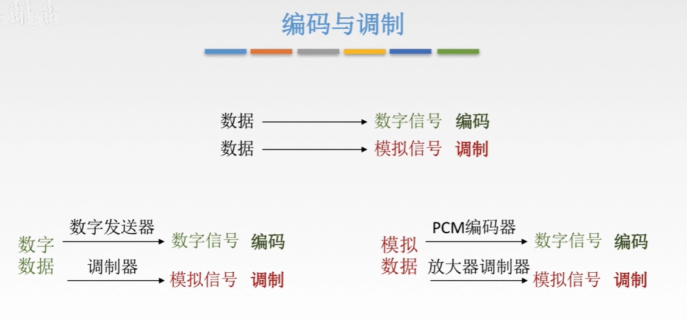

### 数字数据编码为数字信号

  

#### 非归零编码

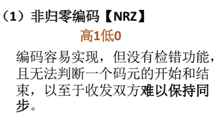  

#### 曼彻斯特编码

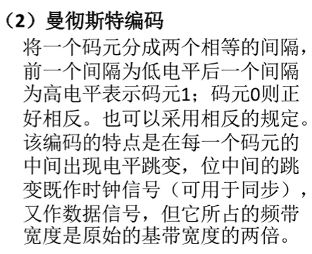  

#### 差分曼彻斯特编码

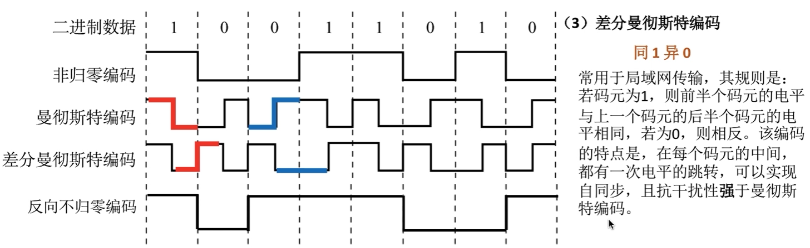

#### 归零编码

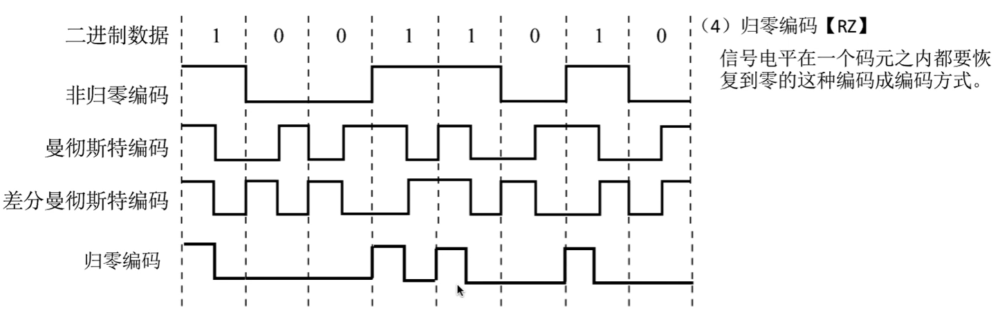    

#### 反向不归零编码

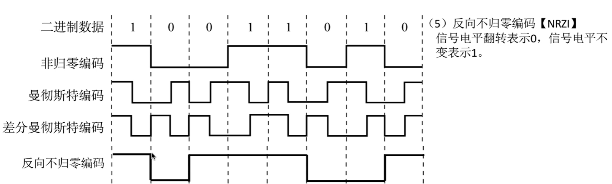  

#### 4B/5B编码

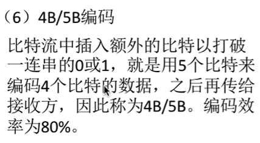  

### 数字数据调制为模拟信号

数字数据调制技术在发送端将数字信号转换为模拟信号，而在接收端将模拟信号还原为数字信号，分别对应于调制解调器的调制和解调过程  

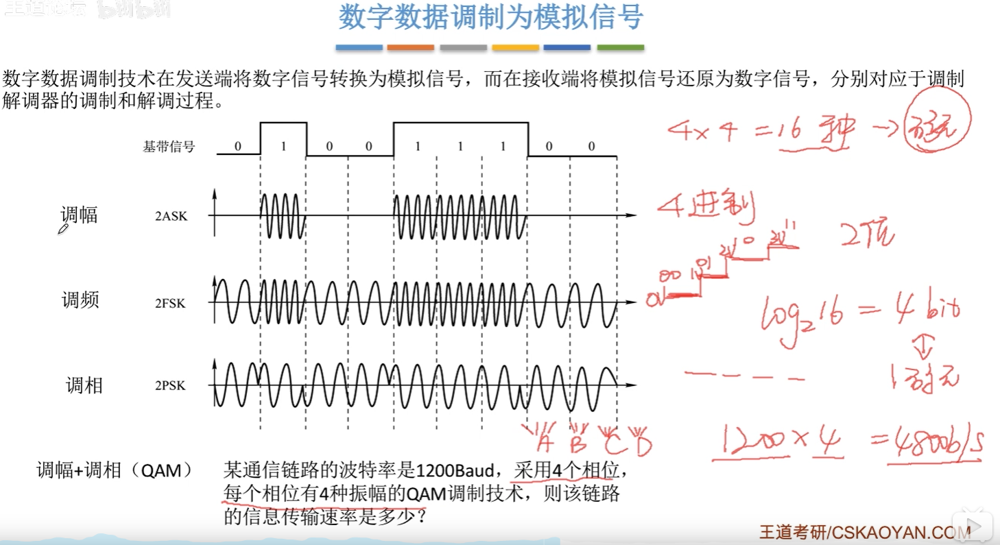  

### 模拟数据编码为数字信号

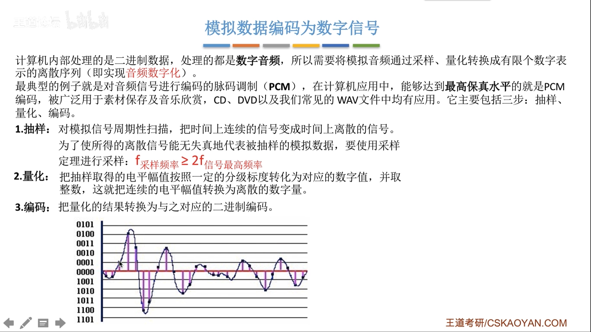  

### 模拟数据调制为模拟信号

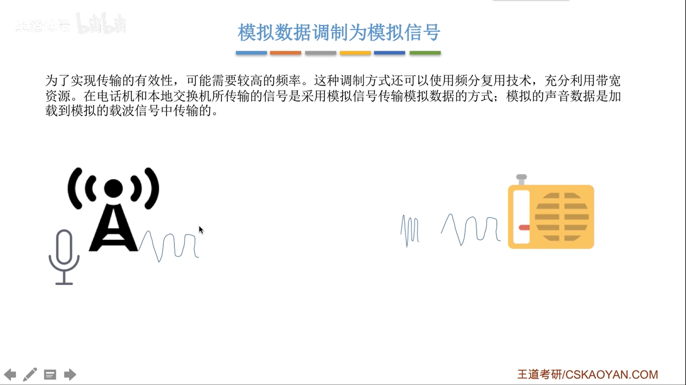  

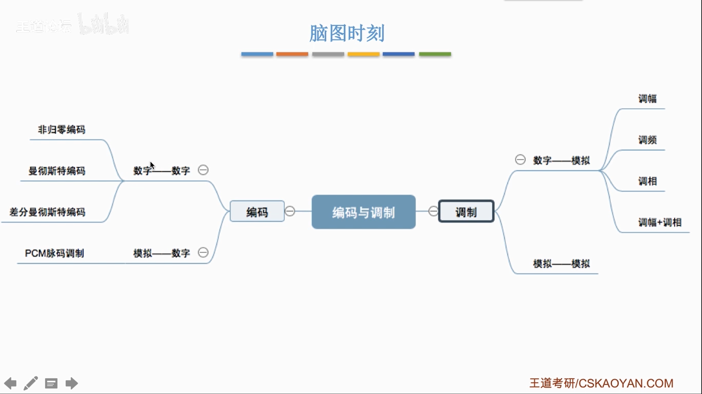  

## 物理层传输介质

  

### 导向性传输介质

#### 双绞线

  

#### 同轴电缆

#### 光纤

  

**多模光纤与单模光纤**  

  

**光线的特点：**    

1、传输损耗小，中继距离长，对远距离传输特别经济。  

2、抗雷电和电磁干扰性能好。  

3、无串音干扰，保密性好，也不容易被窃听或截取数据。  

4、体积小，重量轻。  

### 非导向性传输介质

  

## 物理层设备

### 中继器

**诞生原因**：由于存在损耗，在线路上传输的信号功率会逐渐衰减，衰减到一定程度时将造成信号失真，因此会导致接受错误。  

**中继器的功能**：对信号进行**再生和还原**，对衰减的信号进行放大，保持与原数据相同，以增加信号传输的距离，延长网络长度。  

**中继器的两端**：两端的网络部分是网段，而不是子网，适用于完全相同的两类网络的互连，且两个网段速率要相同。中继器只将任何电缆段上的数据发送到另一段电缆上，它仅作用于信号的电器部分，并不管数据中是是否有错误数据或不适于网段的数据。  

两端可连相同媒体，也可连不同媒体。  

中继器两端的网段一定要是同一个协议。  

  

只能有最多不超过5个网段。  

在这网段内，只能有4个中继器或集线器  

只能有三个网段能挂载工作站(计算机)  

### 集线器

  

**集线器不能分割冲突域**  

如果各主机要同时发送数据，则连在集线器上的工作主机平分带宽  