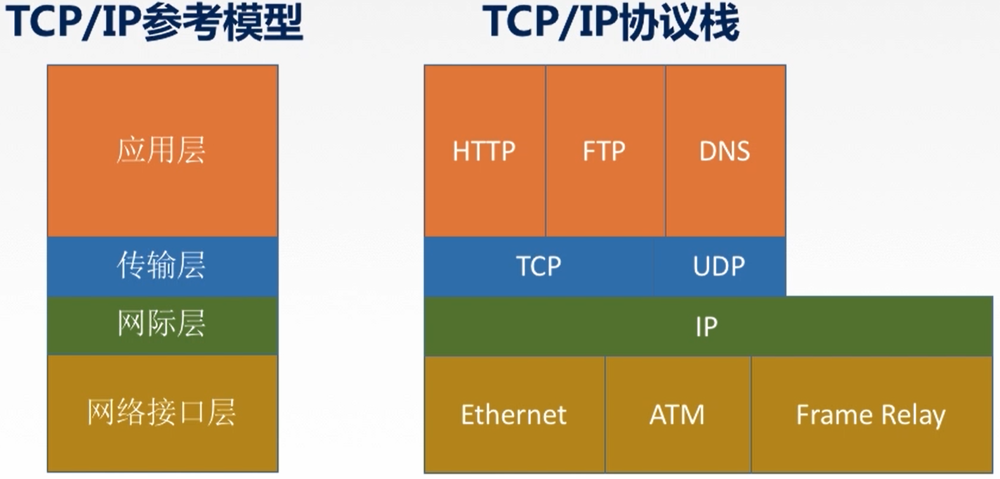
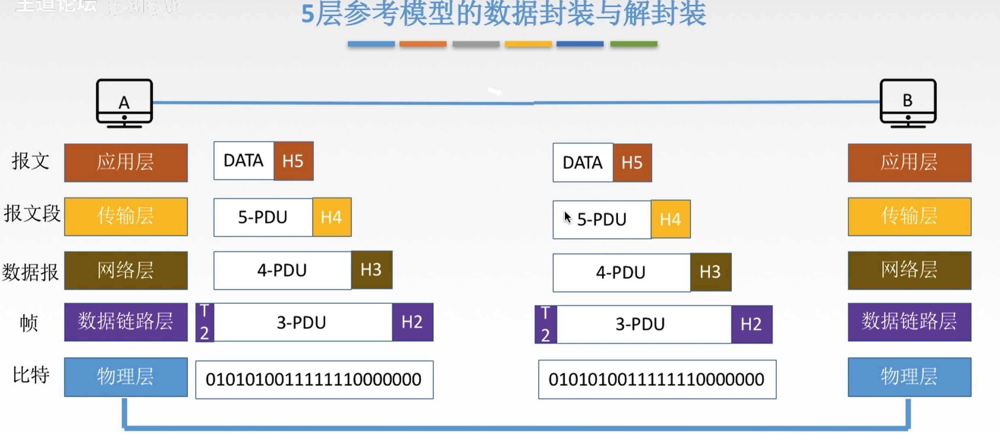
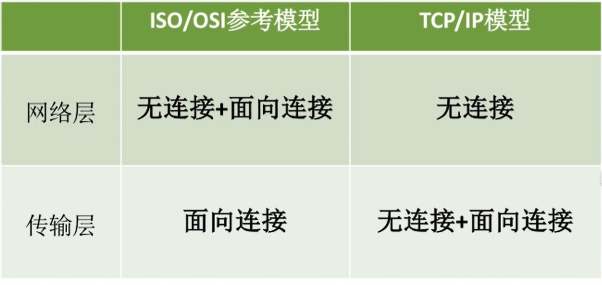
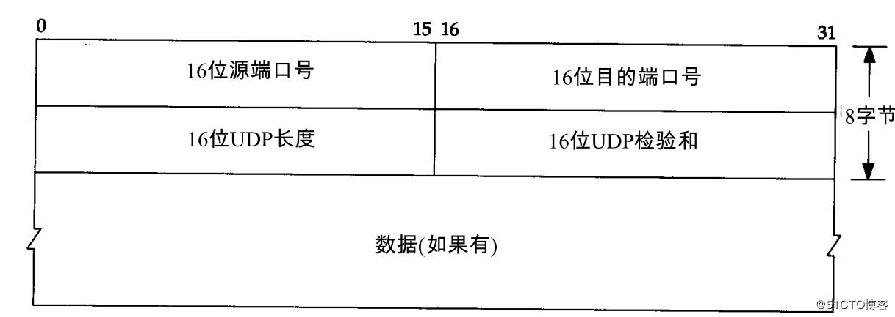

## OSI七层模型

### 应用层

所有能和用户交互产生网络流量的应用程序就属于应用层程序

### 表示层

用于处理两个通信系统中交换信息的表示方式

功能一：数据格式变换  

功能二：数据加密解密  

功能三：数据的压缩与恢复

### 会话层

向表示层实体/用户进程提供**建立连接**并在连接上**有序**地**传输**数据；这既是会话，也是建立同步(SYN)  

功能一：建立、管理、终止会话

功能二：使用校验点可使会话在通信失效时从校验点/同步点继续恢复通信，实现数据同步  

### 传输层

负责主机中**两个进程**的通信，即**端到端**的通信。传输单位是报文段或用户数据报。  

功能一：可靠传输、不可靠传输  

功能二：差错控制  

功能三：流量控制  

功能四：复用分用  

理解复用与分用：  

复用：多个应用层进程可同时使用下面运输层的服务  

分用：运输层把收到的信息分别交付给上面应用层中相应的进程

该层中主要的协议：TCP、UDP

### 网络层

主要任务是把分组从源端传输到目的端，为分组交换网上的不同主机提供通信服务。网络层传输单位是数据报。  

功能一：路由选择(选择最佳路径)  

功能二：流量控制  

功能三：差错控制  

功能四：拥塞控制  

主要协议：IP、IPX、ICMP、IGMP、ARP、RARP、OSPF  

### 数据链路层

主要任务是把网络层传下来的数据报组装成帧。  

数据链路层的传输单位是帧  

功能一：成帧(定义帧的开始和结束)  

功能二：差错控制 帧错+位错  

功能三：流量控制  

功能四：访问(接入)控制 控制对信道的访问  

### 物理层

主要任务是在物理媒体上实现比特流的透明传输，物理层传输单位是比特。  

透明传输：指不管所传数据是什么样的比特组合，都应当能够在链路上传送  

功能一：定义接口特性  

功能二：定义传输模式 单工、半双工、双工  

功能三：定义传输速率  

功能四：比特同步  

功能五：比特编码

## TCP/IP模型&五层参考模型

  

### 五层模型

  

#### 应用层

支持各种网络应用，FTP,SMTP,HTTP

#### 传输层

进程-进程的数据传输 TCP、UDP

#### 网络层

源主机到目的主机的数据分组路由与转发 IP,ICMP

#### 数据链路层

把网络层传下来的数据报组装成帧 Ethernet，PPP

#### 物理层

比特传输

### TCP/IP与OSI参考模型的相同点

1、都分层  

2、基于独立的协议栈的概念  

3、可以实现异构网络互联  

### TCP/IP与OSI参考模型的不同点

1、OSI定义三点：服务、协议、接口  

2、OSI先出现，参考模型先于协议发明，不偏向特定协议  

3、TCP/IP设计之初就考虑到异构网互联问题，IP作为重要层次  

4、  

面向连接分为三个阶段，第一是建立连接，在此阶段，发出一个建立连接的请求。只有在连接成功建立之后，才能开始数据传输，这是第二阶段。接 着，当数据传输完毕，必须释放连接。而面向无连接没有这么多阶段，它直接进行数据传输。  

# 网络协议

## TCP(传输控制协议)

使用TCP前，须建立TCP连接，形成传输数据的通道  

传输前，采用“**三次握手**”方式，点对点通信，是**可靠**的连接  

TCP协议进行通信的两个应用进程：客户端，服务端  

在连接中可进行**大数据量的传输**  

传输完毕，**需释放已建立的连接，效率低**  

报头：

| Type                           | Meaning                                                      |
| ------------------------------ | ------------------------------------------------------------ |
| 源端口号(Source Port)          | 长度为16位，指明发送数据的进程。                             |
| 目的端口号(Destination Port)   | 长度为16位，指明目的主机接收数据的进程。                     |
| 32位序号(Sequence Number)      | 也称为序列号，长度为32位，序号用来标识从TCP发送端向接入端发送的数据字节流进行编号，可以理解成对字节流的计数。 |
| 确认号(Acknowledgement Number) | 长度为32位，确认号包含发送确认的一端所期望收到的下一个序号。确认号只有在ACK标志为1时才有效。 |
| 4位首部长度                    | 表示该tcp报头有多少个4字节(32个bit);用于表示TCP报文首部的长度。用4位（bit）表示，十进制值就是[0,15]，一个TCP报文前20个字节是必有的，后40个字节根据情况可能有可能没有。如果TCP报文首部是20个字节，则该位应是20/4=5 |
| 6位保留(Reserved)              | 必须是0，它是为将来定义新用途保留的。                        |
| 6位标志位(Code Bits)           | URG: 标识紧急指针是否有效  ACK: 标识确认序号是否有效  PSH: 用来提示接收端应用程序立刻将数据从tcp缓冲区读走  RST: 要求重新建立连接. 我们把含有RST标识的报文称为**复位报文段**  SYN: 请求建立连接. 我们把含有SYN标识的报文称为**同步报文段**  FIN: 通知对端, 本端即将关闭. 我们把含有FIN标识的报文称为**结束报文段**  |
| 16位窗口大小(Window Size)      | TCP流量控制由连接的每一端通过声明的窗口大小来提供。          |
| 16位检验和(Checksum)           | 该字段覆盖整个TCP报文段，是个强制性的字段，是由发送端计算和存储，到接收端后，由接收端进行验证 |
| 紧急指针(Urgent Pointer)       | 长度为16位，指向数据中优先部分的最后一个字节，通知接收方紧急数据的长度，该字段在URG标志置位时有效。用来标识哪部分数据是紧急数据 |
| 选项(Options)                  |                                                              |

**TCP三次握手**

>第一次:  
>客户端 - - > 服务器 此时服务器知道了客户端要建立连接了  
>第二次:  
>客户端 < - - 服务器 此时客户端知道服务器收到连接请求了  
>第三次:  
>客户端 - - > 服务器 此时服务器知道客户端收到了自己的回应  
>到这里, 就可以认为客户端与服务器已经建立了连接.  

>刚开始, 客户端和服务器都处于 CLOSE 状态.   
>此时, 客户端向服务器主动发出连接请求, 服务器被动接受连接请求.  
>1、TCP服务器进程先创建传输控制块TCB, 时刻准备接受客户端进程的连接请求, 此时服务器就进入了 LISTEN（监听）状态   
>2、 TCP客户端进程也是先创建传输控制块TCB, 然后向服务器发出连接请求报文，此时报文首部中的同步标志位SYN=1, 同时选择一个初始序列号 seq = x, 此时，TCP客户端进程进入了 SYN-SENT（同步已发送状态）状态。TCP规定, SYN报文段（SYN=1的报文段）不能携带数据，但需要消耗掉一个序号。   
>3、TCP服务器收到请求报文后, 如果同意连接, 则发出确认报文。确认报文中的 ACK=1, SYN=1, 确认序号是 x+1, 同时也要为自己初始化一个序列号 seq = y, 此时, TCP服务器进程进入了SYN-RCVD（同步收到）状态。这个报文也不能携带数据, 但是同样要消耗一个序号。  
>4、TCP客户端进程收到确认后还, 要向服务器给出确认。确认报文的ACK=1，确认序号是 y+1，自己的序列号是 x+1.  
>5、 此时，TCP连接建立，客户端进入ESTABLISHED（已建立连接）状态。当服务器收到客户端的确认后也进入ESTABLISHED状态，此后双方就可以开始通信了。  
>
>为什么不用两次?  
>主要是为了防止已经失效的连接请求报文突然又传送到了服务器，从而产生错误。如果使用的是两次握手建立连接，假设有这样一种场景，客户端发送的第一个请求连接并且没有丢失，只是因为在网络中滞留的时间太长了，由于TCP的客户端迟迟没有收到确认报文，以为服务器没有收到，此时重新向服务器发送这条报文，此后客户端和服务器经过两次握手完成连接，传输数据，然后关闭连接。此时之前滞留的那一次请求连接，因为网络通畅了, 到达了服务器，这个报文本该是失效的，但是，两次握手的机制将会让客户端和服务器再次建立连接，这将导致不必要的错误和资源的费。 
>
>如果采用的是三次握手，就算是那一次失效的报文传送过来了，服务端接受到了那条失效报文并且回复了确认报文，但是客户端不会再次发出确认。由于服务器收不到确认，就知道客户端并没有请求连接。

**TCP四次挥手**

>再来看看何为四次挥手.  
>数据传输完毕后，双方都可以释放连接.  
>此时客户端和服务器都是处于ESTABLISHED状态，然后客户端主动断开连接，服务器被动断开连接.  
>1、客户端进程发出连接释放报文，并且停止发送数据。  
>释放数据报文首部，FIN=1，其序列号为seq=u（等于前面已经传送过来的数据的最后一个字节的序号加1），此时客户端进入FIN-WAIT-1（终止等待1）状态。 TCP规定，FIN报文段即使不携带数据，也要消耗一个序号。  
>2、服务器收到连接释放报文，发出确认报文，ACK=1，确认序号为 u+1，并且带上自己的序列号seq=v，此时服务端就进入了CLOSE-WAIT（关闭等待）状态。  
>TCP服务器通知高层的应用进程，客户端向服务器的方向就释放了，这时候处于半关闭状态，即客户端已经没有数据要发送了，但是服务器若发送数据，客户端依然要接受。这个状态还要持续一段时间，也就是整个CLOSE-WAIT状态持续的时间。  
>3、客户端收到服务器的确认请求后，此时客户端就进入FIN-WAIT-2（终止等待2）状态，等待服务器发送连接释放报文（在这之前还需要接受服务器发送的最终数据）  
>4、服务器将最后的数据发送完毕后，就向客户端发送连接释放报文，FIN=1，确认序号为v+1，由于在半关闭状态，服务器很可能又发送了一些数据，假定此时的序列号为seq=w，此时，服务器就进入了LAST-ACK（最后确认）状态，等待客户端的确认。  
>5、客户端收到服务器的连接释放报文后，必须发出确认，ACK=1，确认序号为w+1，而自己的序列号是u+1，此时，客户端就进入了TIME-WAIT（时间等待）状态。注意此时TCP连接还没有释放，必须经过2∗MSL（最长报文段寿命）的时间后，当客户端撤销相应的TCB后，才进入CLOSED状态。  
>6、服务器只要收到了客户端发出的确认，立即进入CLOSED状态。同样，撤销TCB后，就结束了这次的TCP连接。可以看到，服务器结束TCP连接的时间要比客户端早一些。  

## UDP

将数据、源、目的 封装成数据包，**不需要建立连接**  

每个数据报的大小限制在64K内  

发送不管对方是否准备好，接收方收到也不确认，故是不可靠的  

可以广播发送  

发送数据结束时**无需释放资源，开销小，速度快**  

| Type                         | Meaning                                                      |
| ---------------------------- | ------------------------------------------------------------ |
| 源端口号(Source Port)        | 长度为16位，指明发送数据的进程。                             |
| 目的端口号(Destination Port) | 长度为16位，指明目的主机接收数据的进程。                     |
| 长度                         | 长度为16位，该字段值为报头和数据两部分的总字节数。           |
| 检验和                       | 长度为16位，UDP检验和作用于UDP报头和UDP数据的所有位。由发送端计算和存储，由接收端校验。 |
| 数据                         | -                                                            |

## TCP与UDP的区别

1. TCP面向连接（如打电话要先拨号建立连接）;UDP是无连接的，即发送数据之前不需要建立连接  
2. CP提供可靠的服务。也就是说，通过TCP连接传送的数据，无差错，不丢失，不重复，且按序到达;UDP尽最大努力交付，即不保证可靠交付  
3. UDP具有较好的实时性，工作效率比TCP高，适用于对高速传输和实时性有较高的通信或广播通信。  
4. 每一条TCP连接只能是点到点的;UDP支持一对一，一对多，多对一和多对多的交互通信。  
5. TCP对系统资源要求较多，UDP对系统资源要求较少。  