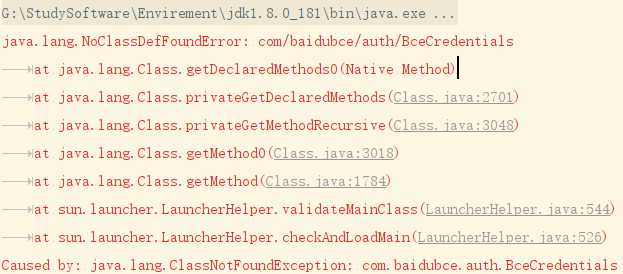
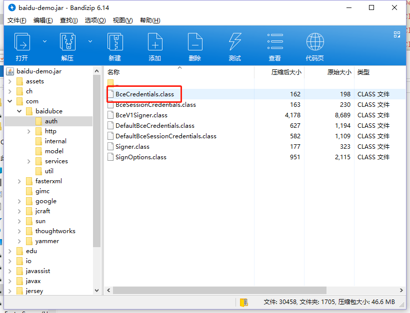

# Jar包中有类文件，但是依然包NoClassDefFoundError错误

**背景**：  

最开始，是想打一个jar包，然后使用java -jar 来运行这个jar包，发现一直报`错误: 找不到或无法加载主类 XC`的错误。  

**分析**：  

根据以往经验，首先检查是不是manifest.mf这个文件中的main-class写错导致找不到主类。但是经过检查发现并没有写错。    

  

  

之后又想到使用`-cp`来指定加载jar，并指定启动类，发现问题依旧，这就奇怪了，明明jar包中有这类，并且路径正确，是不可能读不到的，并且使用如下代码去读取jar中的文件名也是没有问题的。  

```java
JarFile jarFile = new JarFile("F:\\baidu-demo.jar");
Enumeration<JarEntry> entries = jarFile.entries();
while (entries.hasMoreElements()) {
    String name = entries.nextElement().getName();
    if (name.contains("com/baidubce/auth/BceCredentials")) {
        System.out.println(name);
    }
}
```

通过读类加载源码，发现在类加载中是可以输出debug信息的，代码如下：  

```java
//URLClassPath.class
private static final boolean DEBUG = AccessController.doPrivileged(new GetPropertyAction("sun.misc.URLClassPath.debug")) != null;
```

由此，可以在启动的时候加上如下JVM参数`-Dsun.misc.URLClassPath.debug=true`  

这时候就不再单纯的是一个找不到或无法加载主类这种单一的提示了  

```shell
F:\>java -Dsun.misc.URLClassPath.debug=true -cp baidu-demo.jar XC
URLClassPath.getResource("XC.class")
URLClassPath.getResource("XC.class")
Opening file:F:/baidu-demo.jar
java.lang.Exception: Stack trace
        at java.lang.Thread.dumpStack(Unknown Source)
        at sun.misc.URLClassPath$JarLoader$1.run(Unknown Source)
        at sun.misc.URLClassPath$JarLoader$1.run(Unknown Source)
        at java.security.AccessController.doPrivileged(Native Method)
        at sun.misc.URLClassPath$JarLoader.ensureOpen(Unknown Source)
        at sun.misc.URLClassPath$JarLoader.<init>(Unknown Source)
        at sun.misc.URLClassPath$3.run(Unknown Source)
        at sun.misc.URLClassPath$3.run(Unknown Source)
        at java.security.AccessController.doPrivileged(Native Method)
        at sun.misc.URLClassPath.getLoader(Unknown Source)
        at sun.misc.URLClassPath.getLoader(Unknown Source)
        at sun.misc.URLClassPath.getNextLoader(Unknown Source)
        at sun.misc.URLClassPath.getResource(Unknown Source)
        at java.net.URLClassLoader$1.run(Unknown Source)
        at java.net.URLClassLoader$1.run(Unknown Source)
        at java.security.AccessController.doPrivileged(Native Method)
        at java.net.URLClassLoader.findClass(Unknown Source)
        at java.lang.ClassLoader.loadClass(Unknown Source)
        at sun.misc.Launcher$AppClassLoader.loadClass(Unknown Source)
        at java.lang.ClassLoader.loadClass(Unknown Source)
        at sun.launcher.LauncherHelper.checkAndLoadMain(Unknown Source)
Error: A JNI error has occurred, please check your installation and try again
Exception in thread "main" java.lang.SecurityException: Invalid signature file digest for Manifest main attributes
        at sun.security.util.SignatureFileVerifier.processImpl(Unknown Source)
        at sun.security.util.SignatureFileVerifier.process(Unknown Source)
        at java.util.jar.JarVerifier.processEntry(Unknown Source)
        at java.util.jar.JarVerifier.update(Unknown Source)
        at java.util.jar.JarFile.initializeVerifier(Unknown Source)
        at java.util.jar.JarFile.getInputStream(Unknown Source)
        at sun.misc.URLClassPath$JarLoader$2.getInputStream(Unknown Source)
        at sun.misc.Resource.cachedInputStream(Unknown Source)
        at sun.misc.Resource.getByteBuffer(Unknown Source)
        at java.net.URLClassLoader.defineClass(Unknown Source)
        at java.net.URLClassLoader.access$100(Unknown Source)
        at java.net.URLClassLoader$1.run(Unknown Source)
        at java.net.URLClassLoader$1.run(Unknown Source)
        at java.security.AccessController.doPrivileged(Native Method)
        at java.net.URLClassLoader.findClass(Unknown Source)
        at java.lang.ClassLoader.loadClass(Unknown Source)
        at sun.misc.Launcher$AppClassLoader.loadClass(Unknown Source)
        at java.lang.ClassLoader.loadClass(Unknown Source)
        at sun.launcher.LauncherHelper.checkAndLoadMain(Unknown Source)
```

由此可知，是由于`Invalid signature file digest for Manifest main attributes`导致这个jar包并没有被jvm接受，从而没有加进URLClassLoader的加载链里。

这个错误，是由于META-INF中包含了签名文件(`META-INF/*.SF`)以及签名block文件(`META-INF/**.DSA`)，由于我们把依赖的jar包都解压后整合到了自己的全依赖jar包中，自然是无法通过这些校验文件的校验的，所以这个jar包会被jvm认为不能加载，从而导致NoClassDefError发生。这时，我们只要删除掉META-INF文件夹中的SF和DSA文件，该jar包就能被JVM成功加载了。  

> **在maven打包的时候以及使用artifact打包jar的时候，都要注意这一点**

> 对Jar包的数字签名和验证过程和前面描述的数字签名原理和过程一致。Jar包是待发送的消息，经过签名后，Jar包内置入了数字签名和public key，验证者可以使用这两项数据进行验证。
>
> 实际上，经签名的Jar包内包含了以下内容：
>
> - 原Jar包内的class文件和资源文件
> - 签名文件 META-INF/*.SF：这是一个文本文件，包含原Jar包内的class文件和资源文件的Hash
> - 签名block文件 META-INF/*.DSA：这是一个数据文件，包含签名者的 certificate 和数字签名。其中 certificate 包含了签名者的有关信息和 public key；数字签名是对 *.SF 文件内的 Hash 值使用 private key 加密得来

> 扩展阅读：http://lichuanyang.top/posts/2478/