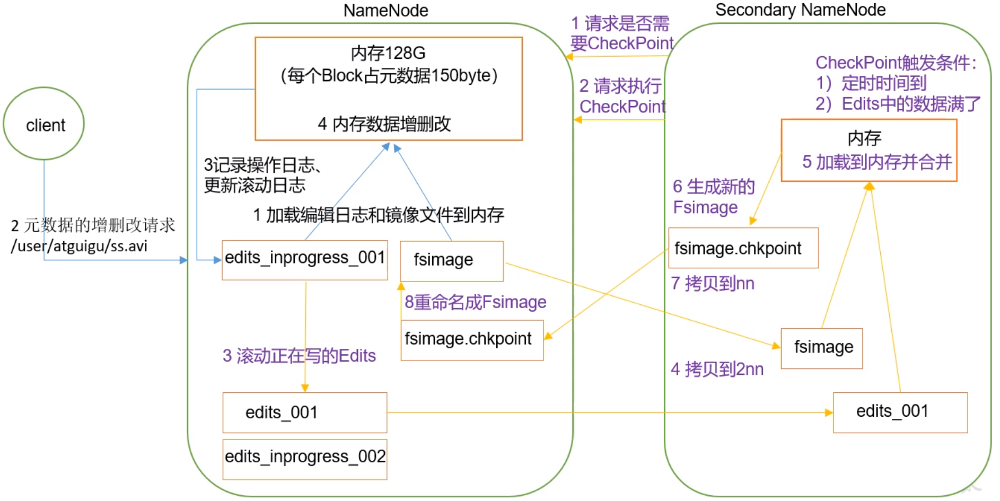
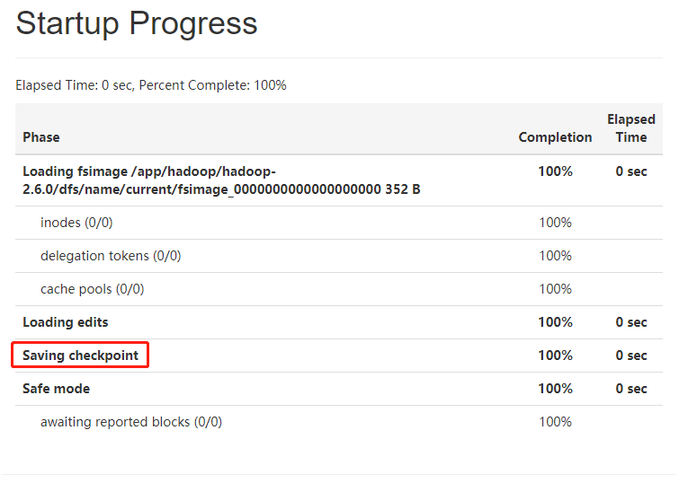
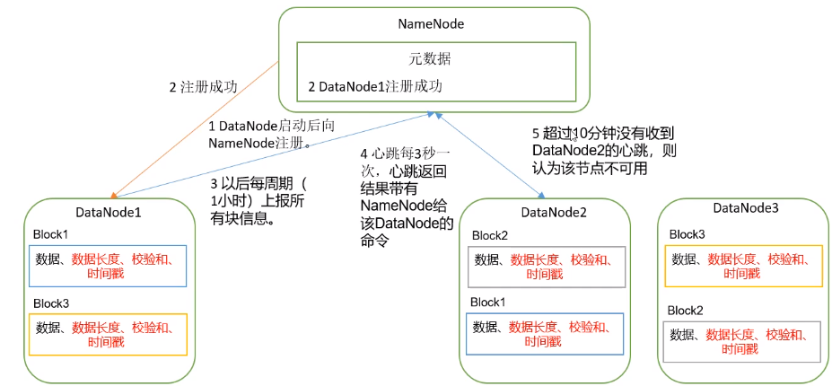
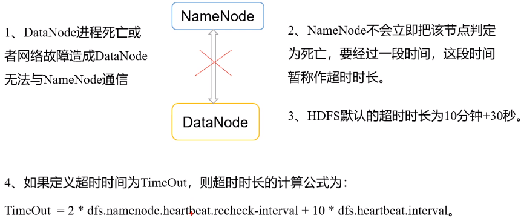

# Hadoop概述

## 基本组成结构

### NameNode

是一个主管，管理者。  负责：

1、管理HDFS的名称空间；  

2、配置副本策略；  

3、管理数据块(Block)映射信息；

4、处理客户端读写请求；  

5、NameNode内存中保存着所有文件的元数据信息，元数据包括文件路径，文件名，所有者，所属组，权限，创建时间等

### client

1、文件切分。文件上传HDFS的时候，Client将文件切分成一个一个的Block，然后进行上传；

2、与NameNode交互，获取文件的位置信息；

3、与DataNode交互，读取或者写入数据；

4、Client提供一些命令来管理HDFS，比如NameNode格式化；

5、Client可以通过一些命令来访问HDFS，比如对HDFS增删查改操作

### Secondary NameNode

它并非是Name Node的热备。当NameNode挂掉的时候，它并不能马上替换NameNode并提供服务。  

1、辅助NameNode，分担其工作量，比如定期合并Fsimages和Edit，并推送给NameNode；

### JournalNode(QJM)

EditLog的存储节点，以及做一些归并操作，Active NameNode会将edit log push到JournalNode。standby NameNode则每两分钟，从journal node pull edit log 到本地进行合并操作。也就是说，进行了主从切换，数据不一致的地方最多就是2分钟之间的数据。

## HDFS 文件块大小

HDFS中的文件在物理上是分块储存的(Block)，块的大小可以通过配置参数(dfs.blocksize)来规定，**默认大小在Hadoop2.x版本中的128M，老版本是64M**  


> **思考题**：为什么块的大小不能设置太小，也不能设置太大？
>
> 1、HDFS的块设置的太小，会增加寻址时间，程序一直在找块的开始位置 (类比文件碎片)
>
> 2、如果块设置的太大，从磁盘传输数据的时间会明显大于定位这个块开始位置所需时间，导致程序在处理这块数据时会非常慢 
>
> 所以，**HDFS块的大小设置主要取决于磁盘传输速率**

## HDFS的数据流

### 写流程

  


1、客户端调用FileSystem.create()来创建文件。    

2、DistributedFileSystem**使用RPC**调用NameNode节点，在文件系统的命名空间中创建一个新的文件。NameNode节点首先确定文件原来不存在，并且客户端有创建文件的权限，然后创建文件元数据信息，之后返回文件的state。  

3、DistributedFileSystem根据NN返回的文件state**使用TCP连接**创建DFSOutPutStream并返回给客户端用于写数据。  

4、客户端开始写数据，DFSOutPutStream将数据分成块，写入data queue。  

5、Data Queue由DataStreamer读取，并通知NameNode节点分配DataNode，用来存储数据块(副本默认是3)，分配的DataNode放在一个Pipeline中。  

6、Data Streamer将数据块写入Pipeline中的第一个DataNode，第一个DataNode将数据发往第二个DataNode，第二个DataNode把数据发往第三个DataNode。  

7、DFSOutPutStream为发出去的数据块保存了ackQueue，等待pipeline中的数据节点告知数据已经写入成功。  

8、当客户端结束写入数据，则调用 stream的close函数。此操作将所有的数据块写入pipeline中的DataNode，并等待acoQueue返回成功。最后通知NameNode文件上传完成。  

**注意点：**

1、如果在建立数据传输通道的过程中失败，那这次上传就失败了，Client会抛连不上DN的异常  

2、如果是在传输数据的过程中失败：  

2.1、是Client与第一个DN的传输过程中失败，那本次文件上传就失败  

2.2、如果是第一个DN与后续DN传输数据的过程中失败，那上传是可以继续进行的并且返回成功信号。(因为，数据已经传到了第一个DN上，只不过是1副本，如果设置的副本数不为1，则会触发自动备份，第一个DN会继续去寻找其他可用的DN进行备份)  

> 追加写入文件和创建文件流程类似，区别是，第一次创建写入数据到DataNode的流是在当前文件最后一个块对应的机器上进程创建，而写文件是直接随机选择的机器节点。

#### 节点距离计算

在HDFS写数据的过程中，NameNode会选择距离待上传数据最近距离的DataNode接收数据。  

**节点距离：两个节点到达最近的公共祖先的距离总和**  

  

#### 机架感知

> http://hadoop.apache.org/docs/r2.7.2/hadoop-project-dist/hadoop-hdfs/HdfsDesign.html#Data_Replication
>
> For the common case, when the replication factor is three, HDFS’s placement policy is to put one replica on one node in the local rack, another on a different node in the local rack, and the last on a different node in a different rack

**副本节点选择**  


### 读流程

  

1、Client向NameNode请求下载文件  

2、NameNode响应文件是否存在以及是否能下载  

3、Client请求下载第一个Block  

4、NameNode返回Block所在的DN列表  

5、Client只会向1个DN建立数据传输通道，如果第一个DN无法建立连接，则使用第二个DN，不行则第三个，直到返回的DN列表中没有DN可用时，则提示文件下载失败。

6、传输完后NameNode告诉Client文件传输完成。

## NN与2NN工作机制

edits.log记录了每一次元数据的变动  

fsimage是元数据镜像

  

CheckPoint触发条件：  

1、通常SecondaryNameNode每隔一个小时执行一次`dfs.namenode.checkpoint.period = 3600 `  

2、一分钟检查一次操作次数`dfs.namenode.checkpoint.check.period = 60`，当操作次数达到1百万时`dfs.namenode.checkpoint.txns = 1000000`，SecondaryNameNode执行一次。  

> 当namenode启动后，会立即叫Secondary NameNode进行一次合并，如下图所示

  

## DataNode工作机制

当DataNode向NameNode注册成功后。将会每周期(默认1小时)上报该DataNode所有块的信息。  

另外还有心跳机制，DataNode会给NameNode发送心跳包，**心跳返回结果带有NameNode给该DataNode的命令**  

超过10分钟没有收到DataNode的心跳，则认为该节点不可用。  

  

### DN掉线时限参数设置

DataNode进程死亡或者网络故障造成DataNode无法与NameNode通信，NameNode不会立即把该节点判定为死亡，要经过一段时间，这段时间称为超时时长。  

HDFS默认的超时时长为10分钟 + 30秒  

  

```xml
<property>
    <name>dfs.namenode.heartbeat.recheck-interval</name>
    <value>300000</value>
</property>
<property>
    <name> dfs.heartbeat.interval </name>
    <value>3</value>
</property>
```

### 数据完整性

传输一般数据用的是CRC算法，而传输元数据使用的是MD5  

1、当DataNode读取Block的时候，它会计算CheckSum。  

2、如果计算后的CheckSum，与Block创建时值不一样，说明Block已经损坏。  

3、Client读取其他DataNode上的Block。  

4、DataNode在其文件创建后周期验证CheckSum，

# 问答

## HDFS存入大量小文件有什么影响

**元数据层面**：每个小文件都有一份元数据，这些元数据都保存在NameNode内存中。所以小文件过过多，会占用NameNode服务器大量内存，影响NameNode性能和使用寿命。  

**计算层面**：默认情况下MR会对每个小文件启用一个Map任务计算，非常影响计算性能。同时也影响磁盘寻址时间。  

> 一般一个文件的元数据占用在150字节左右，所有有面试官会问，HDFS能存多少个文件 -> NameNode堆内存 / 150字节 = 能存文件数

### 小文件归档

每个文件均按块存储，每个块的元数据存储在NameNode的内存中，因此HDFS存储小文件会非常低效。**因为大量的小文件会耗尽NameNode中的大部分内存。但注意，存储小文件所需要的磁盘容量和数据块的大小无关。**例如，一个1MB的文件设置为128MB的块存储，实际使用的是1MB的磁盘空间，而不是128MB。  

解决存储小文件：  

HDFS存档文件或HAR文件，是一个更高效的文件存档工具。具体来说，HDFS存档文件对内还是一个一个独立文件，对NameNode而言却是一个整体，减少了NameNode的内存。

> 执行归档命令：hadoop archive -archiveName input.har -p /user/atguigu/input /user/atguigu/output
>
> 查看归档内部内容：`hdfs dfs -ls -R har:///user/atguigu/output/input.har`

## HDFS参数调优

1、dfs.namenode.handler.count = 20*log2(cluster size)

> NameNode有一个工作线程池，用来处理不同DataNode的并发心跳以及客户端并发的元数据操作。对于大集群或者有大量客户端的集群来说，通常需要增大参数dfs.namenode.handler.count,其默认值为10.设置该值的一般原则是将其设置为集群大小的自然对数乘以20，即20log(N),N为集群大小

2、编辑日志存储路径dfs.namenode.edits.dir设置与镜像文件存储路径dfs.namenode.name.dir尽量分开，达到最低写入延迟。

