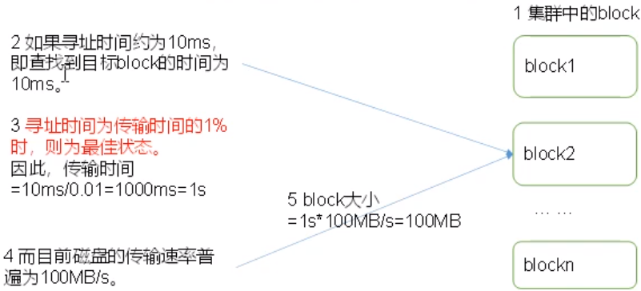
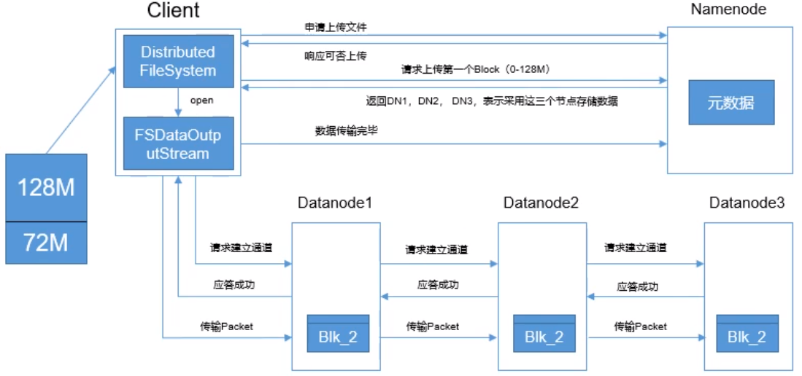
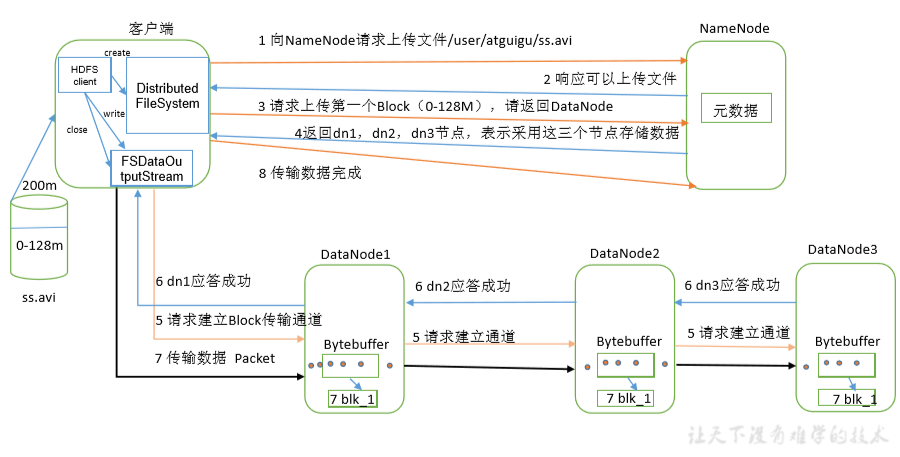
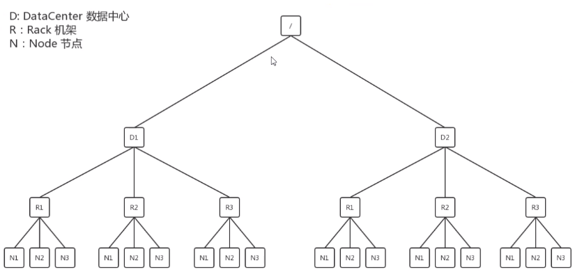
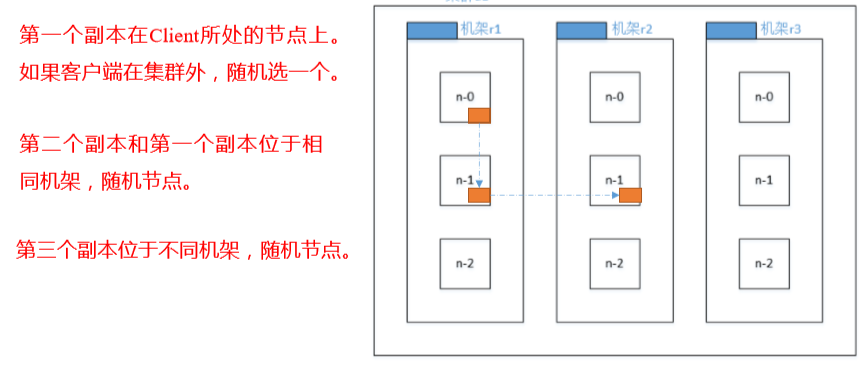
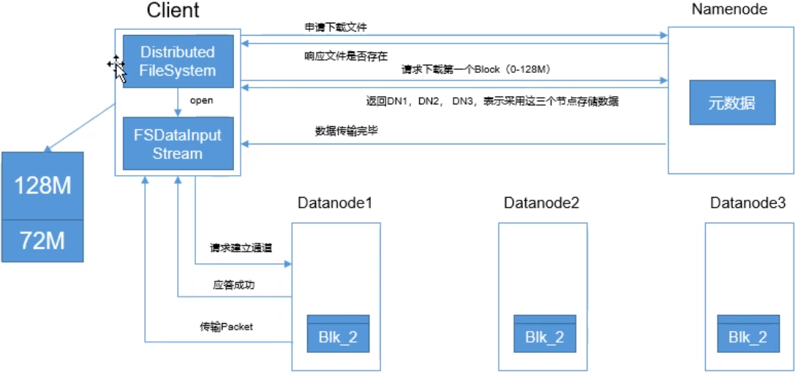

# Hadoop概述

## 基本组成结构

### NameNode

是一个主管，管理者。  负责：

1、管理HDFS的名称空间；  

2、配置副本策略；  

3、管理数据块(Block)映射信息；

4、处理客户端读写请求；  

### client

1、文件切分。文件上传HDFS的时候，Client将文件切分成一个一个的Block，然后进行上传；

2、与NameNode交互，获取文件的位置信息；

3、与DataName交互，读取或者写入数据；

4、Client提供一些命令来管理HDFS，比如NameNode格式化；

5、Client可以通过一些命令来访问HDFS，比如对HDFS增删查改操作

### Secondary NameNode

它并非是Name Node的热备。当NameNode挂掉的时候，它并不能马上替换NameNode并提供服务。  

1、辅助NameNode，分担其工作量，比如定期合并Fsimages和Edit，并推送给NameNode；

## HDFS 文件块大小

HDFS中的文件在物理上是分块储存的(Block)，块的大小可以通过配置参数(dfs.blocksize)来规定，**默认大小在Hadoop2.x版本中的128M，老版本是64M**  

> **思考题**：为什么块的大小不能设置太小，也不能设置太大？
>
> 1、HDFS的块设置的太小，会增加寻址时间，程序一直在找块的开始位置 (类比文件碎片)
>
> 2、如果块设置的太大，从磁盘传输数据的时间会明显大于定位这个块开始位置所需时间，导致程序在处理这块数据时会非常慢 
>
> 所以，**HDFS块的大小设置主要取决于磁盘传输速率**

## HDFS的数据流

### 写流程

  

1、客户端向NameNode申请上传文件。  

2、NameNode响应是否可以上传。  

3、Client请求上传第一个Block(0~128M)  

4、NameNode返回可以储存数据的DN列表(DN数量取决于设置的副本数)  

> NameNode返回的需要存入数据的DataNode，不是随便返回的，第一个DN是离Client最近的DataNode，后两个是由DN1选出来的

5、Client请求与DN1建立数据传输通道，与此同时，DN1也与DN2，DN2与DN3建立数据传输通道。  

6、Client向DN1传输Packet每个(64KB)，**当DN1收到Packet的时候，他一边往本地写，一边将数据发往下一个DN**。  

> 注意：Packet发送给下游DN的时候不是等这个packet成功再发下一个，而是放在队列里，当一个packet成功就从队列中移除**(dn1 每传一个 packet 会放入一个应答队列等待应答)**。

7、当最后一个DN落盘成功后，会回复应答成功的信息给上一个DN，以此类推，直到DN1回复给Client  

8、传完所有Block之后，Client告诉NameNode，数据传输完成。  

**注意点：**

1、如果在建立数据传输通道的过程中失败，那这次上传就失败了，Client会抛连不上DN的异常  

2、如果是在传输数据的过程中失败：  

2.1、是Client与第一个DN的传输过程中失败，那本次文件上传就失败  

2.2、如果是第一个DN与后续DN传输数据的过程中失败，那上传是可以继续进行的并且返回成功信号。(因为，数据已经传到了第一个DN上，只不过是1副本，如果设置的副本数不为1，则会触发自动备份，第一个DN会继续去寻找其他可用的DN进行备份)  

#### 节点距离计算

在HDFS写数据的过程中，NameNode会选择距离待上传数据最近距离的DataNode接收数据。  

**节点距离：两个节点到达最近的公共祖先的距离总和**  

  

#### 机架感知

> http://hadoop.apache.org/docs/r2.7.2/hadoop-project-dist/hadoop-hdfs/HdfsDesign.html#Data_Replication
>
> For the common case, when the replication factor is three, HDFS’s placement policy is to put one replica on one node in the local rack, another on a different node in the local rack, and the last on a different node in a different rack

**副本节点选择**  

### 读流程

  

1、Client向NameNode请求下载文件  

2、NameNode响应文件是否存在以及是否能下载  

3、Client请求下载第一个Block  

4、NameNode返回Block所在的DN列表  

5、Client只会向1个DN建立数据传输通道，如果第一个DN无法建立连接，则使用第二个DN，不行则第三个，直到返回的DN列表中没有DN可用时，则提示文件下载失败。

6、传输完后NameNode告诉Client文件传输完成。

## NN与2NN工作机制

edits.log记录了每一次元数据的变动  

fsimage是元数据镜像