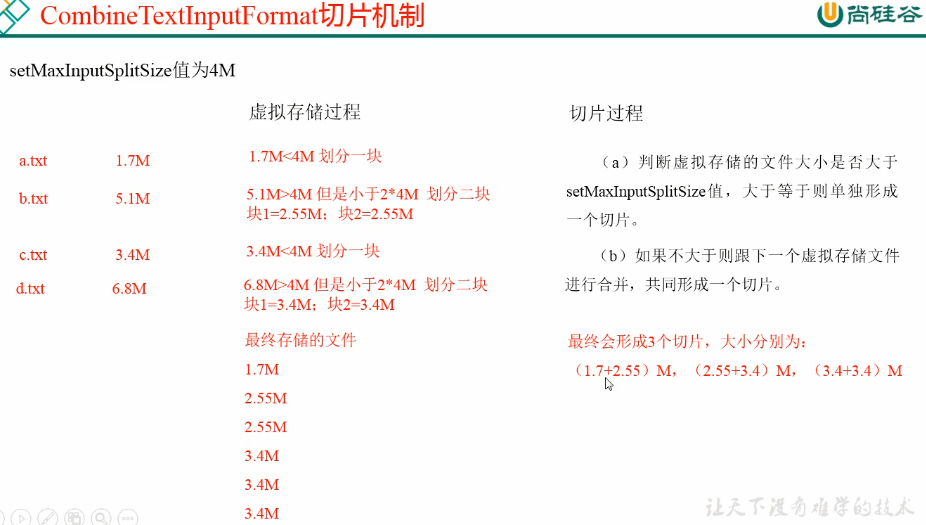
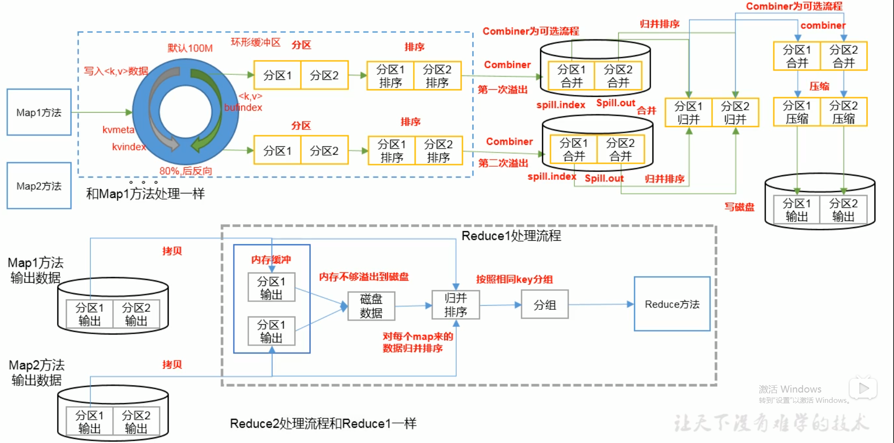

# 框架原理

## 并行度决定机制

数据块：Block是HDFS物理上把数据分成一块一块  

数据切片：数据切片只是在逻辑上对输入进行分片，并不会在磁盘上将其切分成片进行存储  

1、一个Job的Map阶段并行度由客户端在提交Job时的切片数决定  

2、每一个split切片分配一个MapTask并行实例处理  

3、默认情况下，切片大小 = blocksize  

4、切片时不考虑数据集整体性，而是逐个针对每一个文件单独切片  

## 数据输入

### FileInputFormat切片源码解析

1、程序先找到你数据存储的目录。  

2、开始遍历处理(规划切片)目录下的每一个文件

3、遍历第一个文件ss.txt

  3.1、获取文件大小fs.sizeOf(ss.txt)  

  3.2、计算切片大小  

```java
//getFormatMinSplitSize()返回1，getMinSplitSize()如果没有配置mapreduce.input.fileinputformat.split.minsize，则默认返回1
long minSize = Math.max(getFormatMinSplitSize(), getMinSplitSize(job));
//如果没有配置mapreduce.input.fileinputformat.split.maxsize，默认返回Long的最大值
long maxSize = getMaxSplitSize(job);
//获取HDFS block大小
long blockSize = file.getBlockSize();
//内部实现：Math.max(minSize -> 1, Math.min(maxSize -> Long.MAX_VALUE, blockSize -> 128M)
long splitSize = computeSplitSize(blockSize, minSize, maxSize);
```

  3.3、默认情况下，切片大小 = blocksize  

  3.4、开始切，形成第一个切片：ss.txt-0:128M 第二个切片：128:256M 第三个切片：256:300M  

> 每次切片时，**都要判断切完剩下的部分是否大于块的1.1倍**，不大于切分大小的1.1倍就不会进行切分。所以，轻微超过切分大小是不会导致切分进行的

```java
private static final double SPLIT_SLOP = 1.1;   // 10% slop
((double) bytesRemaining)/splitSize > SPLIT_SLOP
```

  3.5、将切片信息写到一个切片规划文件中  

  3.6、整个切片的核心过程在getSplit()方法中完成  

  3.7、inputSplit只记录了切片的元数据信息，比如起始位置、长度以及所在的节点列表等。  

4、提交切片规划文件到YARN上，YARN上的MRAppMaster就可以根据切片规划文件计算开启MapTask个数。   

### CombineTextInputFormat切片机制

框架默认的是TextInputFormat切片机制，是对任务按文件规划切片，不管文件多小，都会是一个单独的切片，都会交给一个MapTask处理，这样如果有大量小文件，就会产生大量的MapTask，处理效率极其低下。

**应用场景**  

CombineTextInputFormat用于小文件过多的场景，它可以将小文件从逻辑上规划到一个切片中，这样，多个小文件就可以交给一个MapTask处理。  

**虚拟存储切片最大值设置**  

setMaxInputSplitSize值为4M  

  

## Shuffle机制

Map方法先将数据写入环型缓冲区并进行分区，当缓冲区使用过了80%的时候，反向，原来的数据溢写到磁盘，之后进行排序，

之后相应的分区数据进行归并排序。  

  

## Join

### ReduceJoin

Map端的主要工作：为来自不同表或文件的KeyValuedui ,打标签以区别不同的来源记录。然后用连接字段作为Key，其余部分和新加的标志作为Value，最后进行输出。  

Reduce段的主要工作：在Reduce段以连接字段作为Key的分组已经完成，我们只需要在每一个分组当中将那些来源不同文件的记录(在Map阶段已经打标志)分开，最后进行合并就OK了。  

