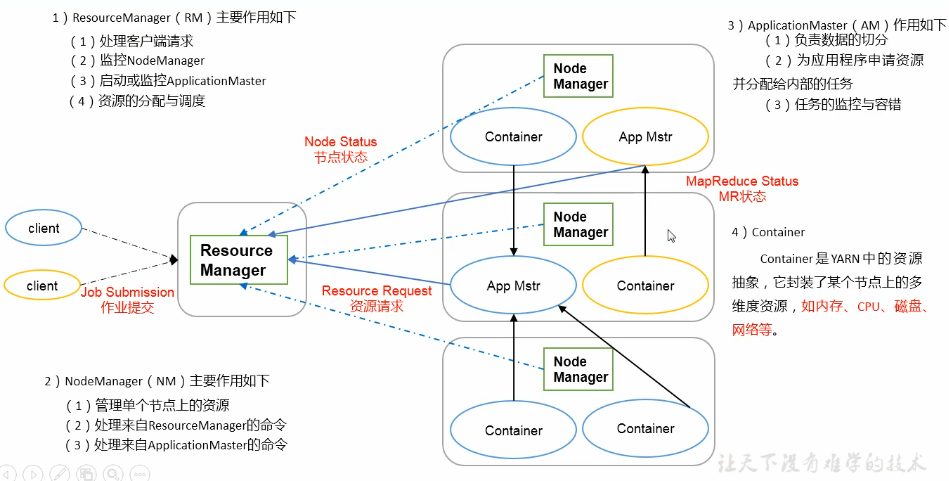
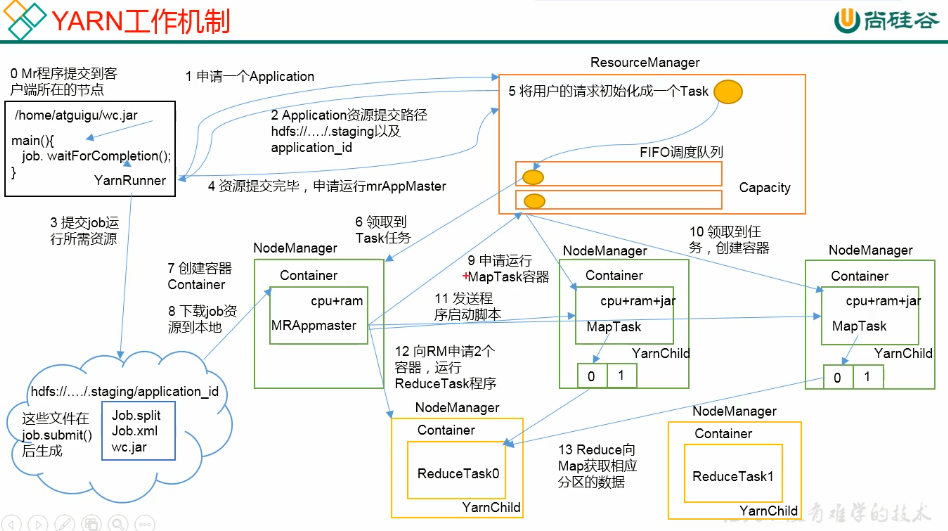
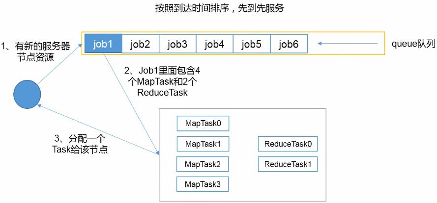
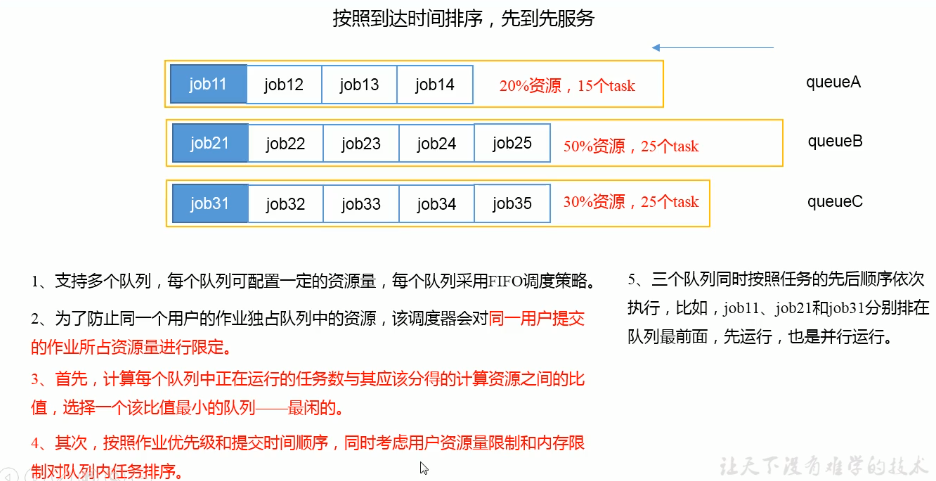
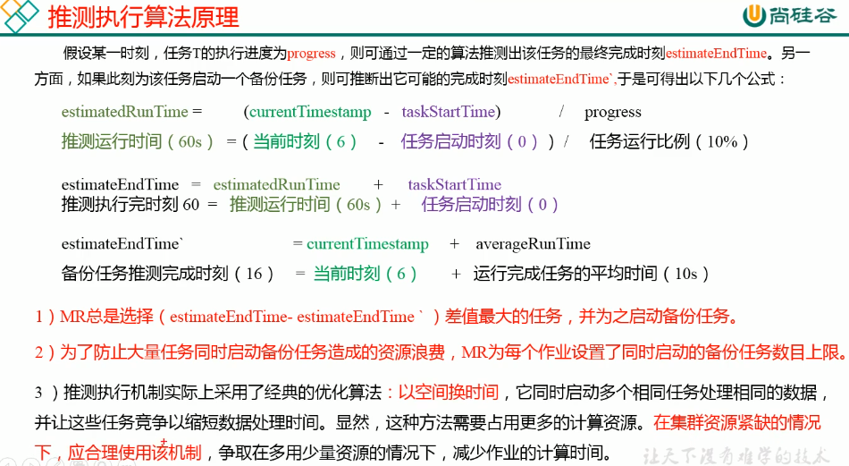

# YARN

## 组件

    

### ResourceManager

1、处理客户端请求  

2、监控NodeManager  

3、启动或监控ApplicationMaster  

4、资源的分配与调度  

### NodeManager

1、管理单个节点上的资源  

2、处理来自ResourceManager的命令  

3、处理来自ApplicationMaster的命令  

### ApplicationMaster

1、负责数据的切分  

2、为应用程序申请资源并分配给内部的任务  

3、任务的监控与容错  

### Container

container是YARN中的资源抽象，它封装了某个节点上的多维度资源，如内存、CPU、磁盘、网络等。

## 工作机制

1、MR程序提交到客户端所在的节点，通过`job.waitForCompletion()`  

2、客户端向ResourceManager申请一个Application，ResourceManager返回一个Application资源提交路径`hdfs://../.staging`以及application_id  

3、提交job运行所需的资源，例如Job.split, Job.xml, wc.jar(MR任务的jar包)  

4、资源提交完毕，申请运行ApplicationMaster  

5、ResourceMaster将用户的请求初始化成一个Task，放入自己的FIFO调度队列中  

6、NodeManager从队列中获取到Task  

7、创建Container  

8、下载job资源到本地，并开始运行ApplicationMaster  

9、根据切片信息，向ResourceManager申请运行MapTask容器，请求又会打包成Task放入调度队列    

10、空闲NodeManager领取到任务，创建容器。  

11、ApplicationMaster发送程序启动脚本给启动的Container

12、等MapTask结束之后，ApplicationMaster向ResourceManager申请容器来运行ReduceTask程序

  

## 资源调度器

默认是**CapacityScheduler**

### FIFO

按照到达时间排序，先到先服务  

  

### Capacity Scheduler

  

在此调度器中有多个队列，每个队列可配置一定的资源量，每个队列采用FIFO调度策略  

为了防止同一个用户的作业独占队列中的资源，该调度器会对同一用户提交的作业所占资源量进行限定  

首先，计算每一个队列中正在运行的任务数与其应该分得的计算资源之间的比值，选择一个该比值最小的队列--最闲的  

其次，按照作业优先级和提交时间顺序，同时考虑用户资源量限制和内存限制对队列内任务排序。  

### Fair scheduler

按照缺额排序，缺额大者优先  

支持多队列多用户，每个队列中的资源量可以配置，同一队列中的作业公平共享队列中所有资源  

### 推测执行

**作业完成时间取决于最慢的任务完成时间**  

发现拖后腿的任务，比如某个任务运行速度远慢于任务平均速度。为拖后腿任务启动一个备份任务，同时运行。谁先运行完，则采用谁的结果。  

**执行推测任务的前提条件**  

每个Task只能有一个备份任务  

当前Job已完成的Task必须不小于**0.05%**  

开启推测执行参数设置

#### 不能启用推测执行机制的情况

任务间存在严重的负载倾斜  

特殊任务，比如任务向数据库中写数据

#### 算法原理

  

## 优化

### 对于大量小文件job，可以开启JVM重用

开启JVM重用会减少45%运行时间。  

JVM重用原理：一个Map运行在一个JVM上，开启重用的话，该Map在JVM上运行完毕后，JVM继续运行其他Map

具体设置：mapreduce.job.jvm.numtasks值在10-20之间