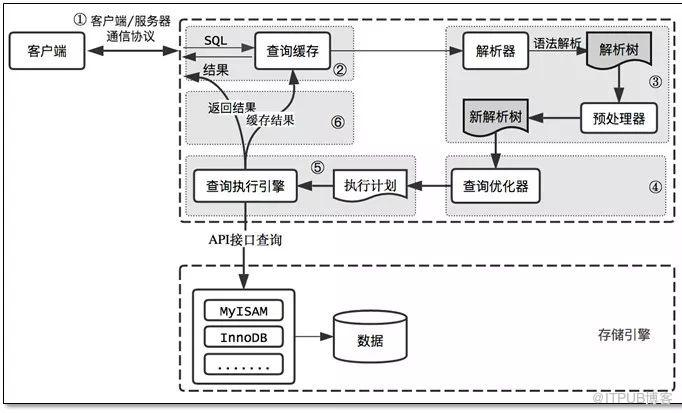
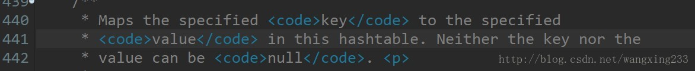
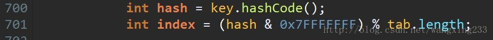
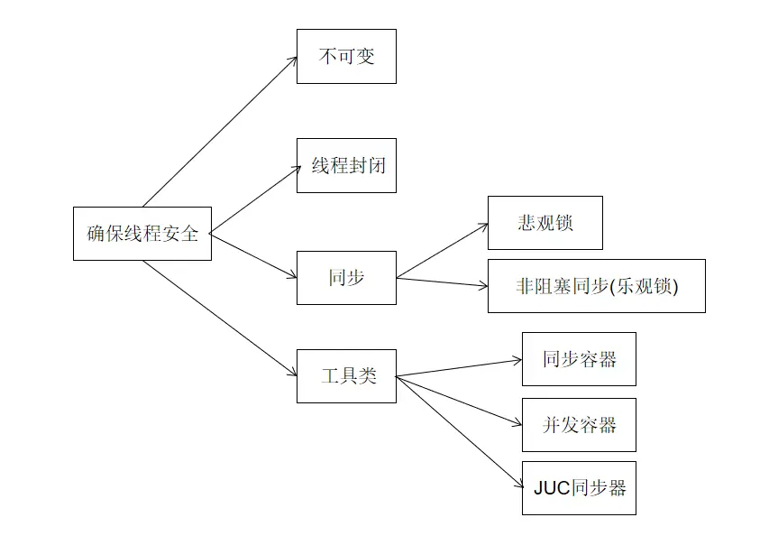
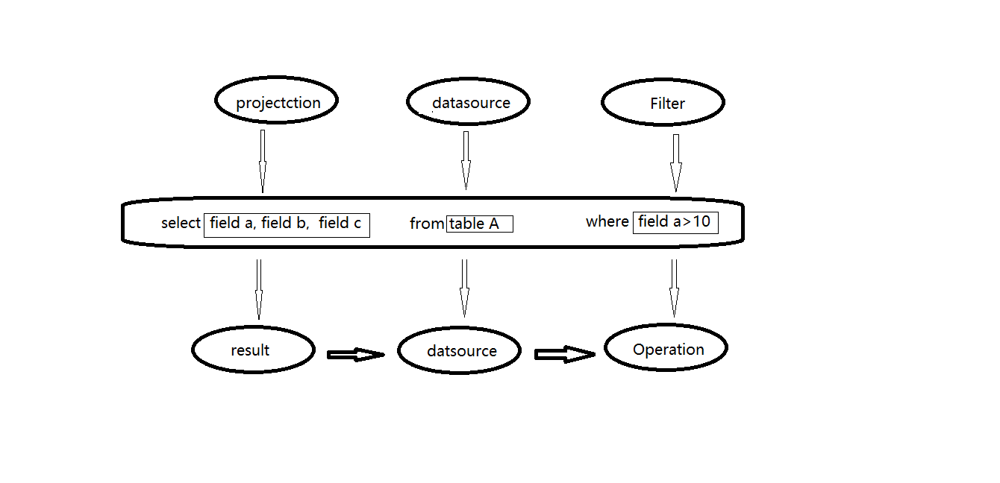

# 20191217-面试经历

时长：1小时  

&nbsp;&nbsp;[数据库](#数据库)  
&nbsp;&nbsp;&nbsp;&nbsp;[MySQL查询过程](#mysql查询过程)  
&nbsp;&nbsp;&nbsp;&nbsp;[常见的SQL优化方法](#常见的sql优化方法)  
&nbsp;&nbsp;&nbsp;&nbsp;[给你一条sql，你怎么知道这条sql有没有命中索引](#给你一条sql你怎么知道这条sql有没有命中索引)  
&nbsp;&nbsp;[计算机网络](#计算机网络)  
&nbsp;&nbsp;&nbsp;&nbsp;[TCP/UDP的区别了解么](#tcp和udp的区别了解么)  
&nbsp;&nbsp;&nbsp;&nbsp;[http默认端口号,https呢](#http默认端口号https呢)  
&nbsp;&nbsp;&nbsp;&nbsp;[DNS是干什么的](#dns是干什么的)  
&nbsp;&nbsp;[JAVA基础](#java基础)  
&nbsp;&nbsp;&nbsp;&nbsp;[HashMap和HashTable 有什么区别](#hashmap和hashtable-有什么区别)  
&nbsp;&nbsp;&nbsp;&nbsp;[ArrayList和LinkedList有什么区别](#arraylist和linkedlist有什么区别)  
&nbsp;&nbsp;&nbsp;&nbsp;[当Arraylist和LinkedList存相同数量的数据，哪个占用内存空间更大](#当arraylist和linkedlist存相同数量的数据哪个占用内存空间更大)  
&nbsp;&nbsp;&nbsp;&nbsp;[lock和synchronized的区别](#lock和synchronized的区别)  
&nbsp;&nbsp;&nbsp;&nbsp;[Object对象tostring方法一般用在什么地方](#object对象tostring方法一般用在什么地方)  
&nbsp;&nbsp;&nbsp;&nbsp;[JVM垃圾回收器，垃圾回收算法有哪些](#jvm垃圾回收器垃圾回收算法有哪些)  
&nbsp;&nbsp;&nbsp;&nbsp;[如何保证线程安全](#如何保证线程安全)  
&nbsp;&nbsp;[Git](#git)  
&nbsp;&nbsp;&nbsp;&nbsp;[git rebase和git merge有什么区别](#git-rebase和git-merge有什么区别)  
&nbsp;&nbsp;[负载均衡](#负载均衡)  
&nbsp;&nbsp;&nbsp;&nbsp;[常用的负载均衡手段有哪些](#常用的负载均衡手段有哪些)  
&nbsp;&nbsp;[实际业务场景处理](#实际业务场景处理)  
&nbsp;&nbsp;&nbsp;&nbsp;[线上CPU负载很高，利用率接近饱和的时候，我们应该怎样去定位问题，避免出现一些过载情况](#线上cpu负载很高-利用率接近饱和的时候-我们应该怎样去定位问题-避免出现一些过载情况)  
&nbsp;&nbsp;[算法](#算法)  
&nbsp;&nbsp;&nbsp;&nbsp;[排序算法](#排序算法)  
&nbsp;&nbsp;&nbsp;&nbsp;[二叉树遍历方式 & 前中后序遍历方式是怎么样的](#二叉树遍历方式以及前中后序遍历方式是怎么样的)  
&nbsp;&nbsp;[大数据](#大数据)  
&nbsp;&nbsp;&nbsp;&nbsp;[Spark](#spark)  
&nbsp;&nbsp;&nbsp;&nbsp;&nbsp;&nbsp;[spark-sql的工作原理 && spark-sql和spark-core有什么关系](#spark-sql的工作原理以及spark-sql和spark-core有什么关系)  
&nbsp;&nbsp;&nbsp;&nbsp;&nbsp;&nbsp;[RDD编程工作原理](#rdd编程工作原理)  
&nbsp;&nbsp;&nbsp;&nbsp;[HBASE](#hbase)  
&nbsp;&nbsp;&nbsp;&nbsp;&nbsp;&nbsp;[了解过哪些hbase源码](#了解过哪些hbase源码)  
&nbsp;&nbsp;&nbsp;&nbsp;&nbsp;&nbsp;[你是什么原因，去了解hbase的源码](#你是什么原因去了解hbase的源码)  
&nbsp;&nbsp;&nbsp;&nbsp;&nbsp;&nbsp;[之后有没有继续看源码，去解决工作中的一些问题](#之后有没有继续看源码去解决工作中的一些问题)  
&nbsp;&nbsp;&nbsp;&nbsp;[Redis](#redis)  
&nbsp;&nbsp;&nbsp;&nbsp;&nbsp;&nbsp;[redis分布式原理，他是怎么样实现分布式的](#redis分布式原理他是怎么样实现分布式的)  
&nbsp;&nbsp;&nbsp;&nbsp;[Flink](#flink)  
&nbsp;&nbsp;&nbsp;&nbsp;&nbsp;&nbsp;[Flink工作原理说一下](#flink工作原理说一下)  
&nbsp;&nbsp;&nbsp;&nbsp;[Zookeeper](#zookeeper)  
&nbsp;&nbsp;&nbsp;&nbsp;&nbsp;&nbsp;[zookeeper一般用在什么场景](#zookeeper一般用在什么场景)  

## 数据库

### MySQL查询过程



### 常见的SQL优化方法

1、避免在where子句中对字段进行表达式操作，以及函数操作  
```sql
-- 这条语句就会造成引擎放弃使用索引
select user_id,user_project from user_base where age*2=36;
-- 可以改写成这条语句
select user_id,user_project from user_base where age=36/2;
```
2、语句中IN包含的值不应太多  
MySQL对于IN做了相应的优化，即将IN中的常量全部存储在一个数组里面，而且这个数组是排好序的、但是如果数值较多，产生的消耗也是比较大的。再列如：`select id from t where num in (1,2,3)`对于连续的数值，能用between就不要使用IN，再或者使用连接来代替  

3、SELECT语句务必指明字段名称  
`select *`增加了很多不必要的消耗(CPU、IO、内存、网络带宽);增加了使用覆盖索引的可能性  
4、当只需要一条数据的时候，使用limit 1  
这是为了使explain 中type列达到const类型  

5、如果排序字段没有用到索引，就尽量少排序  

6、如果限制条件中其他字段没有索引，尽量少使用or  
or两边的字段中，如果有一个不是索引字段，而其他条件也不是索引字段，会造成该查询不走索引的情况。很多时候使用union all或者是union的方式来代替"or"会得到更好的效果  

7、尽量使用union all代替union  
union和union all的差异主要是前者需要将结果集合并后再进行唯一性过滤操作，这就会涉及到排序，增加大量的CPU运算加大资源消耗及延迟。当然，union all的前提条件是两个结果集没有重复数据。  

8、不使用ORDER BY RAND()  
```sql
select id from `dynamic` order by rand() limit 1000;
```
上面的SQL语句可优化为：
```sql
select id from dynamic t1 join (select rand() * (select max(id) from dynamic) as nid) t2 on t1.id > t2.nidlimit 1000;
```
9、区分in和exists、not in和not exists
`select * from 表A where id in (select id from 表B)`相当于`select * from 表A where exists(select * from 表B where 表B.id=表A.id)`  
区分in和exists主要是造成了驱动顺序的改变(这是性能变化的关键)，如果是exists，那么以外层表为驱动表，先被访问，如果是IN，那么先执行子查询。所以**IN**适合于**外表大而内表小**的情况;**exists**适合于**外表小而内表大**的情况  
关于not in 和not exist，推荐使用not exists，不仅仅是效率问题，not in可能存在逻辑问题。  

10、使用合理的分页方式以提高分页效率  
```sql 
select id,name from product limit 866613, 20
```
使用以上SQL语句做分页的时候，会发现随着表数量的增加，直接使用limit分页查询会越来越慢。  
优化的方法可以取前一页的最大行的id，然后根据这个最大的id来限制下一页的起点，之后再limit需要取得行数  

11、分段查询  
一些用户选择页面中，可能一些用户选择的时间范围过大，造成查询缓慢。主要原因是扫描行数过多。这时候可以通过程序，分段进行查询，循环遍历，将结果合并处理  

12、避免在where子句中对字段进行null值判断  
对于null的判断会导致引擎放弃使用索引而进行全表扫描  

13、不建议使用%前缀模糊查询  
例如`like "%name"`或者`like "%name%"`，这种查询会导致索引失效而进行全表扫描。但是可以使用`like “name%”`  
对于`"%name%"`这种查询，可以通过创建全文索引来达到使用索引的目的  

```sql
-- 创建全文索引 
ALTER TABLE `dynamic_201606` ADD FULLTEXT INDEX `idx_user_name` (`user_name`);
-- 使用全文索引
select id,fnum,fdst from dynamic_201606 where match(user_name) against('zhangsan' in boolean mode);
```
14、避免隐式类型转换  
where子句中出现column字段的类型和传入的参数类型不一致的时候发生的类型转换，建议先确定where中的参数类型。  

15、对于联合索引来说，要遵循最左前缀匹配原则  
举例来说索引含有字段id、name、school、可以直接使用id字段，也可以id、name这样的顺序，但是name、school都无法使用这个索引。所以在创建联合索引的时候一定要注意索引字段顺序，常用的查询字段放在最前面  

16、对于联合索引来说，如果存在范围查询，比如between、>、<等条件，会造成后面的索引字段失效  

17、Join相关 

  

left join A表作为驱动表，inner join MySQL会自动找出那个数据少的表作为驱动表，right join B表为驱动表  
join时合理的利用索引：被驱动表的索引字段作为on的限制字段  
利用小表去驱动大表：  
  
巧用STRAIGHT_JOIN  
首先来解释下STRAIGHT_JOIN到底是用做什么的：
> STRAIGHT_JOIN is similar to JOIN, except that the left table is always read before the right table. 
This can be used for those (few) cases for which the join optimizer puts the tables in the wrong order.

意思就是说STRAIGHT_JOIN功能同**inner join**类似，但能让左边的表来驱动右边的表，能改变优化器对于**联表查询的执行顺序**。  
真实案例：https://blog.huoding.com/2013/06/04/261  

### 给你一条sql你怎么知道这条sql有没有命中索引
使用EXPLAIN关键字可以模拟优化器执行SQL查询语句，从而知道MySQL是如何处理你的SQL语句的。分析你的查询语句或是表结构的性能瓶颈。   
通过EXPLAIN，我们可以分析出以下结果：  
表的读取顺序  
数据读取操作的操作类型  
哪些索引可以使用  
哪些索引被实际使用  
表之间的引用  
每张表有多少行被优化器查询  
explain计划解析：  
  
字段含义：  

| Column        | Meaning                                                      |
| ------------- | ------------------------------------------------------------ |
| id            | select查询的序列号，id相同，执行顺序由上到下。id不同，如果是子查询，id的序号会递增，id越大，越先被执行 |
| select_type   | 用来表示查询的类型，主要是用于区别普通查询、联合查询，子查询等复杂查询 |
| table         | 执行的表                                                     |
| type          | 显示的是使用了哪种查询类型，从最好到最差依次是`system > const > eq_ref > ref > range > index > all` |
| possible_keys | 显示可能应用在这张表中的索引，一个或多个。查询涉及到的字段上若存在索引，则该索引将被列出，但不一定被查询实际使用 |
| key           | 实际使用的索引，如果为null则没有使用索引                     |
| key_len       | 表示索引中使用的字节数，可通过该列计算查询中使用的索引长度，在不损失精确性的情况下，长度越短越好。key_len显示的值为索引字段的最大可能长度，并非实际使用长度，即key_len是根据表定义计算而得，不是通过表内检索出的 |
| ref           | 显示索引的哪一列被使用了，如果可能的话，最好是一个常数。哪些列或常量被用于查找索引列上的值 |
| rows          | 根据表统计以及索引选用情况，大致估算出找到所需的记录需要读取的行数，也就是说用的越少越好 |
| Extra         | 包含不适合在其他列中显示但十分重要的额外信息、               |

**select_type**:

| select_type  | Meaning                                                      |
| ------------ | ------------------------------------------------------------ |
| SIMPLE       | 简单的select查询，查询中**不包含**子查询或者union            |
| PRIMARY      | 查询中若包含任何复杂的子部分，最外层哈讯则被标记为PRIMARY    |
| SUBQUERY     | 在SELECT或WHERE列表中包含了子查询                            |
| DERIVED      | 在FROM列表中**包含的子查询被标记为DERIVED**(衍生)，MySQL会递归的执行这些子查询，把结果放在**临时表**中 |
| UNION        | 若第二个SELECT出现在UNION之后，则被标记为UNION；若UNION包含在FROM子句的子查询中，外层SELECT将被标记为DERIVED |
| UNION RESULT | 从UNION表获取结果的SELECT                                    |

**type**：

| type   | Meaning                                                      |
| ------ | ------------------------------------------------------------ |
| system | 表只有一行记录(等于系统表)，这是const类型的特列，平时不会出现，也可以忽略不计 |
| const  | 表示通过索引一次就找到了，const用于比较primary key或者unique索引。因为只匹配一行数据，所以很快。如将主键置于where 子句中，MySQL就能将该查询转换为一个常量。 |
| eq_ref | 唯一性索引扫描，对于每个索引键，表中只有一条记录与之匹配。常见于主键或唯一索引扫描 |
| ref    | 非唯一性索引扫描，返回匹配某个单独值的所有行，本质上也是一种索引访问，它返回所有匹配某个单独值的行，然后，它可能会找到多个符合条件的行，所以他应该属于查找和扫描的混合体 |
| range  | 只检索给定范围的行，使用一个索引来选择行，key列显示使用了哪个索引，一般就是在你的where语句中出现between、< 、>、in等的查询，这种范围扫描索引比全表扫描要好，因为它只需要开始于索引的某一点，结束于另一点，不用扫描全部索引 |
| index  | Full Index Scan,Index与All区别为index类型只遍历索引树。这通常比ALL快，因为索引未见通常比数据小(也就是说虽然all和Index都是读全表，但index是从索引中读取的，而all是从硬盘读取的) |
| all    | Full Table Scan 将遍历全表以找到匹配的行                     |

**Extra**:

| extra                   | Meaning                                                      |
| ----------------------- | ------------------------------------------------------------ |
| Using filesort          | MySQL会对数据使用一个外部的索引排序，而不是按照表内的索引顺序进行读取。MySQL中无法利用索引完成的排序操作称为“文件排序” |
| Using temporary         | 使用了临时表保存中间结果，MySQL在对查询结果排序时使用了临时表。常见于排序order by和分组查询group by |
| Using index             | 表示相应的select操作中使用了覆盖索引(Covering Index),避免访问了表的数据行，效率不错。如果同时出现using where，表名索引被用来执行索引键值的查找；如果没有同时出现using where，表名索引用来读取数据而非执行查找动作 |
| Using where             | 表明使用了where过滤                                          |
| Using join buffer       | 表明使用了连接缓存，比如说在查询的时候，多表join的次数非常多，那么将配置文件中的缓冲区的join buffer调大些 |
| impossible where | where子句的值总是false，不能用来获取任何元组。例如：`SELECT * FROM t_user WHERE id = '1' and id = '2'` |
| select tables optimized away | 在没有GROUP BY子句的情况下，基于索引优化MIN/MAX操作或者对于MyISAM存储引擎优化COUNT(*)操作，不必等到执行阶段再进行计算，查询执行计划生成的阶段即完成优化 |
| distinct | 优化distinct操作，在找到第一匹配的元组后即停止找同样值的操作 |

所以使用explain执行计划，可以知道是否有走索引

## 计算机网络

### TCP和UDP的区别了解么

**TCP(传输控制协议)**

报头：


| Type                           | Meaning                                                      |
| ------------------------------ | ------------------------------------------------------------ |
| 源端口号(Source Port)          | 长度为16位，指明发送数据的进程。                             |
| 目的端口号(Destination Port)   | 长度为16位，指明目的主机接收数据的进程。                     |
| 32位序号(Sequence Number)      | 也称为序列号，长度为32位，序号用来标识从TCP发送端向接入端发送的数据字节流进行编号，可以理解成对字节流的计数。 |
| 确认号(Acknowledgement Number) | 长度为32位，确认号包含发送确认的一端所期望收到的下一个序号。确认号只有在ACK标志为1时才有效。 |
| 4位首部长度                    | 表示该tcp报头有多少个4字节(32个bit);用于表示TCP报文首部的长度。用4位（bit）表示，十进制值就是[0,15]，一个TCP报文前20个字节是必有的，后40个字节根据情况可能有可能没有。如果TCP报文首部是20个字节，则该位应是20/4=5 |
| 6位保留(Reserved)              | 必须是0，它是为将来定义新用途保留的。                        |
| 6位标志位(Code Bits)           | URG: 标识紧急指针是否有效 <br/>ACK: 标识确认序号是否有效 <br/>PSH: 用来提示接收端应用程序立刻将数据从tcp缓冲区读走 <br/>RST: 要求重新建立连接. 我们把含有RST标识的报文称为**复位报文段** <br/>SYN: 请求建立连接. 我们把含有SYN标识的报文称为**同步报文段** <br/>FIN: 通知对端, 本端即将关闭. 我们把含有FIN标识的报文称为**结束报文段**<br/> |
| 16位窗口大小(Window Size)      | TCP流量控制由连接的每一端通过声明的窗口大小来提供。          |
| 16位检验和(Checksum)           | 该字段覆盖整个TCP报文段，是个强制性的字段，是由发送端计算和存储，到接收端后，由接收端进行验证 |
| 紧急指针(Urgent Pointer)       | 长度为16位，指向数据中优先部分的最后一个字节，通知接收方紧急数据的长度，该字段在URG标志置位时有效。用来标识哪部分数据是紧急数据 |
| 选项(Options)                  |                                                              |

**TCP三次握手**

>第一次:  
客户端 - - > 服务器 此时服务器知道了客户端要建立连接了  
第二次:  
客户端 < - - 服务器 此时客户端知道服务器收到连接请求了  
第三次:  
客户端 - - > 服务器 此时服务器知道客户端收到了自己的回应  
到这里, 就可以认为客户端与服务器已经建立了连接.  


>刚开始, 客户端和服务器都处于 CLOSE 状态.   
>此时, 客户端向服务器主动发出连接请求, 服务器被动接受连接请求.  
>1、TCP服务器进程先创建传输控制块TCB, 时刻准备接受客户端进程的连接请求, 此时服务器就进入了 LISTEN（监听）状态   
>2、 TCP客户端进程也是先创建传输控制块TCB, 然后向服务器发出连接请求报文，此时报文首部中的同步标志位SYN=1, 同时选择一个初始序列号 seq = x, 此时，TCP客户端进程进入了 SYN-SENT（同步已发送状态）状态。TCP规定, SYN报文段（SYN=1的报文段）不能携带数据，但需要消耗掉一个序号。   
>3、TCP服务器收到请求报文后, 如果同意连接, 则发出确认报文。确认报文中的 ACK=1, SYN=1, 确认序号是 x+1, 同时也要为自己初始化一个序列号 seq = y, 此时, TCP服务器进程进入了SYN-RCVD（同步收到）状态。这个报文也不能携带数据, 但是同样要消耗一个序号。  
>4、TCP客户端进程收到确认后还, 要向服务器给出确认。确认报文的ACK=1，确认序号是 y+1，自己的序列号是 x+1.  
>5、 此时，TCP连接建立，客户端进入ESTABLISHED（已建立连接）状态。当服务器收到客户端的确认后也进入ESTABLISHED状态，此后双方就可以开始通信了。  
>
>为什么不用两次?  
>主要是为了防止已经失效的连接请求报文突然又传送到了服务器，从而产生错误。如果使用的是两次握手建立连接，假设有这样一种场景，客户端发送的第一个请求连接并且没有丢失，只是因为在网络中滞留的时间太长了，由于TCP的客户端迟迟没有收到确认报文，以为服务器没有收到，此时重新向服务器发送这条报文，此后客户端和服务器经过两次握手完成连接，传输数据，然后关闭连接。此时之前滞留的那一次请求连接，因为网络通畅了, 到达了服务器，这个报文本该是失效的，但是，两次握手的机制将会让客户端和服务器再次建立连接，这将导致不必要的错误和资源的费。 
>
>如果采用的是三次握手，就算是那一次失效的报文传送过来了，服务端接受到了那条失效报文并且回复了确认报文，但是客户端不会再次发出确认。由于服务器收不到确认，就知道客户端并没有请求连接。

**TCP四次挥手**


>再来看看何为四次挥手.  
数据传输完毕后，双方都可以释放连接.  
此时客户端和服务器都是处于ESTABLISHED状态，然后客户端主动断开连接，服务器被动断开连接.  
1、客户端进程发出连接释放报文，并且停止发送数据。  
释放数据报文首部，FIN=1，其序列号为seq=u（等于前面已经传送过来的数据的最后一个字节的序号加1），此时客户端进入FIN-WAIT-1（终止等待1）状态。 TCP规定，FIN报文段即使不携带数据，也要消耗一个序号。  
2、服务器收到连接释放报文，发出确认报文，ACK=1，确认序号为 u+1，并且带上自己的序列号seq=v，此时服务端就进入了CLOSE-WAIT（关闭等待）状态。  
TCP服务器通知高层的应用进程，客户端向服务器的方向就释放了，这时候处于半关闭状态，即客户端已经没有数据要发送了，但是服务器若发送数据，客户端依然要接受。这个状态还要持续一段时间，也就是整个CLOSE-WAIT状态持续的时间。  
3、客户端收到服务器的确认请求后，此时客户端就进入FIN-WAIT-2（终止等待2）状态，等待服务器发送连接释放报文（在这之前还需要接受服务器发送的最终数据）  
4、服务器将最后的数据发送完毕后，就向客户端发送连接释放报文，FIN=1，确认序号为v+1，由于在半关闭状态，服务器很可能又发送了一些数据，假定此时的序列号为seq=w，此时，服务器就进入了LAST-ACK（最后确认）状态，等待客户端的确认。  
5、客户端收到服务器的连接释放报文后，必须发出确认，ACK=1，确认序号为w+1，而自己的序列号是u+1，此时，客户端就进入了TIME-WAIT（时间等待）状态。注意此时TCP连接还没有释放，必须经过2∗MSL（最长报文段寿命）的时间后，当客户端撤销相应的TCB后，才进入CLOSED状态。  
6、服务器只要收到了客户端发出的确认，立即进入CLOSED状态。同样，撤销TCB后，就结束了这次的TCP连接。可以看到，服务器结束TCP连接的时间要比客户端早一些。  

**UDP**:


| Type                         | Meaning                                                      |
| ---------------------------- | ------------------------------------------------------------ |
| 源端口号(Source Port)        | 长度为16位，指明发送数据的进程。                             |
| 目的端口号(Destination Port) | 长度为16位，指明目的主机接收数据的进程。                     |
| 长度                         | 长度为16位，该字段值为报头和数据两部分的总字节数。           |
| 检验和                       | 长度为16位，UDP检验和作用于UDP报头和UDP数据的所有位。由发送端计算和存储，由接收端校验。 |
| 数据                         | -                                                            |

**区别**：

1. TCP面向连接（如打电话要先拨号建立连接）;UDP是无连接的，即发送数据之前不需要建立连接
2. CP提供可靠的服务。也就是说，通过TCP连接传送的数据，无差错，不丢失，不重复，且按序到达;UDP尽最大努力交付，即不保证可靠交付
3. UDP具有较好的实时性，工作效率比TCP高，适用于对高速传输和实时性有较高的通信或广播通信。
4. 每一条TCP连接只能是点到点的;UDP支持一对一，一对多，多对一和多对多的交互通信
5. TCP对系统资源要求较多，UDP对系统资源要求较少。

### http默认端口号https呢

http:80  

https:443

### DNS是干什么的

DNS(Domain Name System),域名系统（服务）协议（DNS）是一种分布式网络目录服务，主要用于域名与 IP 地址的相互转换，以及控制因特网的电子邮件的发送。

是Internet上解决网上机器命名的一种系统。就像拜访朋友要先知道别人家怎么走一样，Internet上当一台主机要访问另外一台主机时，必须首先获知其地址，TCP/IP中的IP地址是由四段以“.”分开的数字组成，记起来总是不如名字那么方便，所以，就采用了域名系统来管理名字和IP的对应关系。

## JAVA基础

### HashMap和HashTable 有什么区别

简答版：

1、**继承的父类不同**

Hashmap继承自AbstractMap，HashTable继承自Dictionary类。不过它们都实现了同时实现了map、Cloneable（可复制）、Serializable（可序列化）这三个接口

2、**对外提供的接口不同**

Hashtable比HashMap多提供了elements() 和contains() 两个方法。

3、**对Null key 和Null value的支持不同**

Hashtable既不支持Null key也不支持Null value。Hashtable的put()方法的注释中有说明。



HashMap中，null可以作为键，这样的键只有一个；可以有一个或多个键所对应的值为null。当get()方法返回null值时，可能是 HashMap中没有该键，也可能使该键所对应的值为null。因此，在HashMap中不能由get()方法来判断HashMap中是否存在某个键， 而应该用containsKey()方法来判断。

4、**线程安全性不同**

Hashtable是线程安全的，它的每个方法中都加入了Synchronize方法。在多线程并发的环境下，可以直接使用Hashtable，不需要自己为它的方法实现同步  

HashMap不是线程安全的，在多线程并发的环境下，可能会产生死锁等问题

虽然HashMap不是线程安全的，但是它的效率会比Hashtable要好很多。这样设计是合理的。在我们的日常使用当中，大部分时间是单线程操作的。HashMap把这部分操作解放出来了。当需要多线程操作的时候可以使用线程安全的ConcurrentHashMap。ConcurrentHashMap虽然也是线程安全的，但是它的效率比Hashtable要高好多倍。因为ConcurrentHashMap使用了**分段锁**，并不对整个数据进行锁定。


5、**初始容量大小和每次扩充容量大小的不同** 

Hashtable默认的初始大小为11，之后每次扩充，容量变为原来的2n+1。HashMap默认的初始化大小为16。之后每次扩充，容量变为原来的2倍。

6、**计算hash值的方法不同** 

为了得到元素的位置，首先需要根据元素的 KEY计算出一个hash值，然后再用这个hash值来计算得到最终的位置。

Hashtable直接使用对象的hashCode。hashCode是JDK根据对象的地址或者字符串或者数字算出来的int类型的数值。然后再使用除留余数发来获得最终的位置。



Hashtable在计算元素的位置时需要进行一次**除法运算**，而除法运算是比较耗时的。 
HashMap为了提高计算效率，将哈希表的大小固定为了2的幂，这样在取模预算时，**不需要**做除法，只需要做位运算。位运算比除法的效率要**高**很多。

更详细的参考 -> https://www.jianshu.com/p/9857847e2826

### ArrayList和LinkedList有什么区别

**ArrayList是基于索引的数据接口，它的底层是数组。它可以以O(1)时间复杂度对元素进行随机访问**

**LinkedList是以链表的形式存储它的数据，每一个元素都和它的前一个和后一个元素链接在一起，在这种情况下，查找某个元素的时间复杂度是O(n)**

答到这里的时候可以说一下两个的插入，读取，删除的时间复杂度

### 当Arraylist和LinkedList存相同数量的数据哪个占用内存空间更大

LinkedList比ArrayList更占内存，因为LinkedList为每一个节点存储了**两个**引用，一个指向前一个元素，一个指向下一个元素。

https://www.cnblogs.com/yonyong/p/9323588.html

### lock和synchronized的区别

>Synchronized：底层使用指令码方式来控制锁的，映射成字节码指令就是增加来两个指令：monitorenter和monitorexit。当线程执行遇到monitorenter指令时会尝试获取内置锁，如果获取锁则锁计数器+1，如果没有获取锁则阻塞；当遇到monitorexit指令时锁计数器-1，如果计数器为0则释放锁。

> Lock：底层是CAS乐观锁，依赖AbstractQueuedSynchronizer类，把所有的请求线程构成一个CLH队列。而对该队列的操作均通过Lock-Free（CAS）操作。

synchronized 和 lock 的区别，用新的lock有什么好处  

1、synchronized是关键字，属于jvm层面，通过monitorenter和monitorexit实现(底层是通过monitor对象来完成的，其实wait/notify等方法也依赖于monitor对象，只有在同步块或方法中才能调wait/notify等方法)  
lock是具体类(java.util.concurrent.locks.lock)，是api层面的锁  

2、使用方法：  
synchronized 不需要用户手动去释放锁，当synchronized代码执行完后系统会自动让线程释放对锁的占用  
ReentrantLock需要用户手动释放锁，若没有主动释放锁，就有可能导致出现死锁的现象  

3、等待是否可以中断  
synchronized 不可中断，除非抛出异常或者正常运行完成  
ReentrantLock 可中断  
   1、设置超时方法tryLock(long timeout,TimeUnit unit)  
   2、LockInterruptibly()放代码块中，调用interrupt()方法可中断  
4、加锁是否公平  
synchronized非公平锁  
ReentrantLock两者都可以，默认非公平锁，构造方法可以传入boolean值，true：公平, false非公平  

5、锁绑定多个条件Condition  
synchronized 没有  
ReentrantLock用来实现分组唤醒需要唤醒的线程们。可以精确唤醒，而不是像synchronized要么随机唤醒一个线程，要么唤醒全部线程  

**锁种类：**

>可重入锁：Synchronized和ReentrantLook都是可重入锁，锁的可重入性标明了锁是针对线程分配方式而不是针对方法。例如调用Synchronized方法A中可以调用Synchronized方法B，而不需要重新申请锁。
>
>读写锁：按照数据库事务隔离特性的类比读写锁，在访问统一个资源（一个文件）的时候，使用读锁来保证多线程可以同步读取资源。ReadWriteLock是一个读写锁，通过readLock()获取读锁，通过writeLock()获取写锁。
>
>可中断锁：可中断是指锁是可以被中断的，Synchronized内置锁是不可中断锁，ReentrantLock可以通过lockInterruptibly方法中断显性锁。例如线程B在等待等待线程A释放锁，但是线程B由于等待时间太久，可以主动中断等待锁。
>
>公平锁：公平锁是指尽量以线程的等待时间先后顺序获取锁，等待时间最久的线程优先获取锁。synchronized隐性锁是非公平锁，它无法保证等待的线程获取锁的顺序，ReentrantLook可以自己控制是否公平锁。

### Object对象tostring方法一般用在什么地方

日志输出

### JVM垃圾回收器垃圾回收算法有哪些

**垃圾回收算法**

1、标记-整理

2、标记-清除

3、复制算法

4、分代回收

**垃圾回收器**

Serial，parnew，parallel scavenge, cms, Serial old, parallel Old, G1, ZGC	

面试时，这里可以对这些算法以及回收器做更深入的介绍

- Serial收集器（复制算法)
  新生代单线程收集器，标记和清理都是单线程，优点是简单高效。是client级别默认的GC方式，可以通过`-XX:+UseSerialGC`来强制指定。
- Serial Old收集器(标记-整理算法)
  老年代单线程收集器，Serial收集器的老年代版本。
- ParNew收集器(停止-复制算法)　
  新生代收集器，可以认为是Serial收集器的多线程版本,在多核CPU环境下有着比Serial更好的表现。
- Parallel Scavenge收集器(停止-复制算法)
  并行收集器，追求高吞吐量，高效利用CPU。吞吐量一般为99%， 吞吐量= 用户线程时间/(用户线程时间+GC线程时间)。适合后台应用等对交互相应要求不高的场景。是server级别默认采用的GC方式，可用`-XX:+UseParallelGC`来强制指定，用`-XX:ParallelGCThreads=4`来指定线程数。
- Parallel Old收集器(停止-复制算法)
  Parallel Scavenge收集器的老年代版本，并行收集器，吞吐量优先。
- CMS(Concurrent Mark Sweep)收集器（标记-清理算法）
  高并发、低停顿，追求最短GC回收停顿时间，cpu占用比较高，响应时间快，停顿时间短，多核cpu 追求高响应时间的选择。

### 如何保证线程安全

1、使用线程安全的类

2、使用synchronized同步代码块，或者用Lock锁；



https://blog.csdn.net/qq_26545305/article/details/79516610

https://www.jianshu.com/p/207ac3c11975

## Git

### git rebase和git merge有什么区别

git merge：将两个分支，合并提交为一个新提交，并且新提交有2个parent。

git rebase：会取消分支中的每个提交，并把他们临时存放，然后把当前分支更新到最新的origin分支，最后再吧所有提交应用到分支上。

https://blog.csdn.net/liuxiaoheng1992/article/details/79108233

## 负载均衡

### 常用的负载均衡手段有哪些

现有的负载均衡算法主要分为**静态和动态**两类。

静态负载均衡算法以固定的概率分配任务，不考虑服务器的状态信息，如轮转算法、加权轮转算法等；

动态负载均衡算法以服务器的实时负载状态信息来决定任务的分配，如最小连接法、加权最小连接法等。

1、轮询(Round Robin)法

2、随机法

3、随机轮询法

4、源地址hash法

5、加权轮询法(Weight Round Robin)

6、加权随机(Weight Random)法

7、Latency-Aware

## 实际业务场景处理

### 线上CPU负载很高-利用率接近饱和的时候-我们应该怎样去定位问题-避免出现一些过载情况

使用TOP 命令查看是哪个进程占用CPU过多

1、使用 top -Hp [pid]查看java服务线程占用CPU情况，找到线程id后转成16进制

2、使用Jstack，dump线程堆栈，找到之前记录的线程id，查看占用CPU高的线程在干什么

例子：https://blog.csdn.net/Hedy17/article/details/79932988

## 算法

### 排序算法


- n: 数据规模
- k: “桶”的个数
- In-place: 占用常数内存，不占用额外内存
- Out-place: 占用额外内存

https://blog.csdn.net/weixin_41190227/article/details/86600821

### 二叉树遍历方式以及前中后序遍历方式是怎么样的

前序，中序，后续遍历

1.前序遍历：先访问根节点——左子树——右子树。

2.中序遍历：先访问左子树——根节点——右子树，按照这个顺序。

3.后序遍历：和前面差不多，先访问树的左子树——右子树——根节点

4.按层遍历：把一棵树从上到下，从左到右依次写出来。

## 大数据

### Spark

#### spark-sql的工作原理以及spark-sql和spark-core有什么关系



**Core**: 负责处理数据的输入和输出，如获取数据，查询结果输出成DataFrame等

**Catalyst**: 负责处理整个查询过程，包括解析、绑定、优化等

**Hive**: 负责对Hive数据进行处理

**Hive-ThriftServer**: 主要用于对hive的访问

1、语法和词法解析：对写入的sql语句进行词法和语法解析（parse），分辨出sql语句在哪些是关键词（如select ,from 和where）,哪些是表达式，哪些是projection ，哪些是datasource等，判断SQL语法是否规范，并形成逻辑计划。

2、绑定：将SQL语句和数据库的数据字典（列，表，视图等）进行绑定（bind）,如果相关的projection和datasource等都在的话，则表示这个SQL语句是可以执行的。

3、优化（optimize）：一般的数据库会提供几个执行计划，这些计划一般都有运行统计数据，数据库会在这些计划中选择一个最优计划。

4、执行（execute）：执行前面的步骤获取最有执行计划，返回查询的数据集。

**运行原理原理分析：**　

　　**1.使用SesstionCatalog保存元数据**

　　在解析sql语句前需要初始化sqlcontext,它定义sparksql上下文，在输入sql语句前会加载SesstionCatalog，初始化sqlcontext时会把元数据保存在SesstionCatalog中，包括库名，表名，字段，字段类型等。这些数据将在解析未绑定的逻辑计划上使用。

　　**2.使用Antlr生成未绑定的逻辑计划**

　　Spark2.0版本起使用Antlr进行词法和语法解析，Antlr会构建一个按照关键字生成的语法树，也就是生成的未绑定的逻辑计划。

　　**3.使用Analyzer绑定逻辑计划**

　　在这个阶段Analyzer 使用Analysis Rules,结合SessionCatalog元数据，对未绑定的逻辑计划进行解析，生成已绑定的逻辑计划。

　　**4.使用Optimizer优化逻辑计划**

　　Opetimize（优化器）的实现和处理方式同Analyzer类似，在该类中定义一系列Rule,利用这些Rule对逻辑计划和Expression进行迭代处理，达到树的节点的合并和优化。

　　**5.使用SparkPlanner生成可执行计划的物理计划**

　　 SparkPlanner使用Planning Strategies对优化的逻辑计划进行转化，生成可执行的物理计划。

　　**6.使用QueryExecution执行物理计划**

#### RDD编程工作原理

1、 一组分片（Partition），即`数据集的基本组成单位`。对于 RDD 来说，每个分片都会被一个计算任务处理，并决定并行计算的粒度。用户可以在创建 RDD 时指定 RDD 的分片个数，如果没有指定，那么就会采用默认值。默认值就是程序所分配到的 CPU Core 的数目。
2、 一个计算每个分区的函数。`Spark 中 RDD 的计算是以分片为单位的`，每个 RDD 都会实现 compute 函数以达到这个目的。compute 函数会对迭代器进行复合，不需要保存每次计算的结果。
3、RDD 之间的依赖关系。RDD 的每次转换都会生成一个新的 RDD，所以 RDD 之间就会形成类似于流水线一样的前后依赖关系。在部分分区数据丢失时，Spark 可以通过这个依赖关系重新计算丢失的分区数据，而不是对 RDD 的所有分区进行重新计算。
4、一个 Partitioner，即 RDD 的分片函数。当 前Spark 中实现了两种类型的分片函数，一个是基于哈希的 HashPartitioner，另外一个是基于范围的 RangePartitioner。只有对于于 key-value 的 RDD，才会有 Partitioner，非 key-value 的 RDD 的 Parititioner 的值是 None。Partitioner 函数不但决定了 RDD 本身的分片数量，也决定了Parent RDD Shuffle 输出时的分片数量。
5、一个列表，存储存取每个 Partition 的优先位置（preferred location）。对于一个 HDFS 文件来说，这个列表保存的就是每个 Partition 所在的块的位置。按照“移动数据不如移动计算”的理念，Spark 在进行任务调度的时候，会尽可能地将计算任务分配到其所要处理数据块的存储位置。
  RDD 是一个应用层面的逻辑概念。一个 RDD 多个分片。RDD 就是一个元数据记录集，记录了 RDD 内存所有的关系数据。

### HBASE

#### 了解过哪些hbase源码 

#### 你是什么原因去了解hbase的源码

#### 之后有没有继续看源码去解决工作中的一些问题

### Redis

#### redis分布式原理他是怎么样实现分布式的

https://yq.aliyun.com/articles/711825

https://segmentfault.com/p/1210000009708869/read

### Flink

#### Flink工作原理说一下


https://www.cnblogs.com/code2one/p/10123112.html

### Zookeeper

#### zookeeper一般用在什么场景

数据发布/订阅

分布式锁

分布式队列

服务器动态上下线

软负载均衡

统一命名服务

https://my.oschina.net/u/3847203/blog/2876714


# 参考博客

SQL优化: http://blog.itpub.net/31555484/viewspace-2565387/  
explain：https://blog.csdn.net/why15732625998/article/details/80388236  
explain：https://dev.mysql.com/doc/refman/8.0/en/explain-output.html  
TCP：https://blog.csdn.net/sinat_36629696/article/details/80740678  
TCP与UDP区别：https://blog.csdn.net/qq_34624951/article/details/82669444  
HashMap与HashTable区别：https://blog.csdn.net/wangxing233/article/details/79452946  
ArrayList与LinkedList区别：https://www.cnblogs.com/yonyong/p/9323588.html  
JVM垃圾回收 https://www.cnblogs.com/1024Community/p/honery.html  
spark-sql：https://www.cnblogs.com/db-record/p/11832285.html  
spark rdd：https://www.cnblogs.com/Transkai/p/11346639.html  