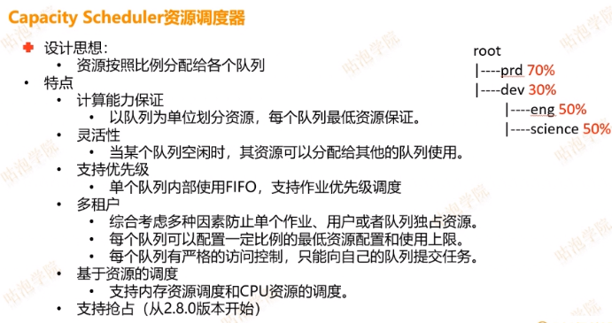
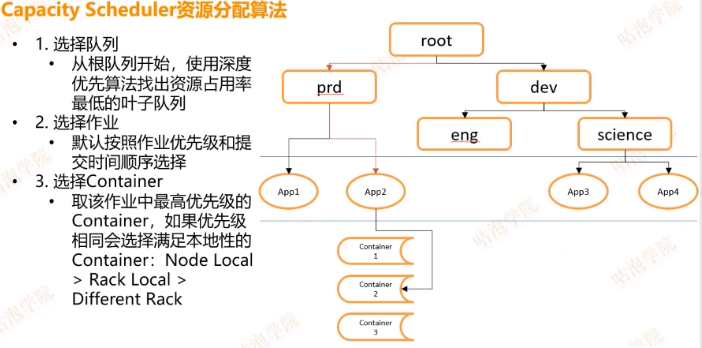
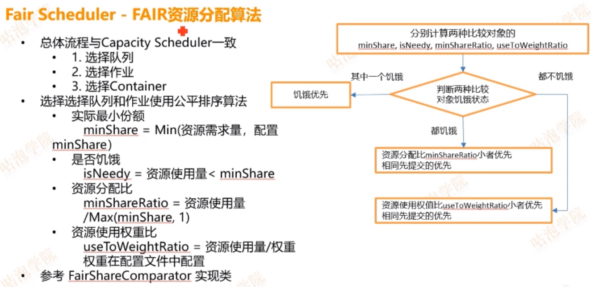
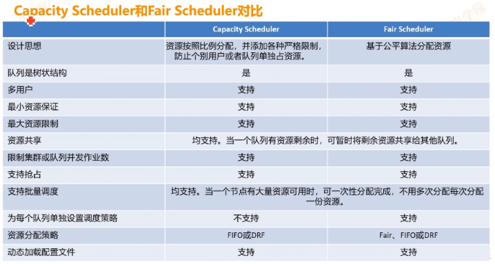
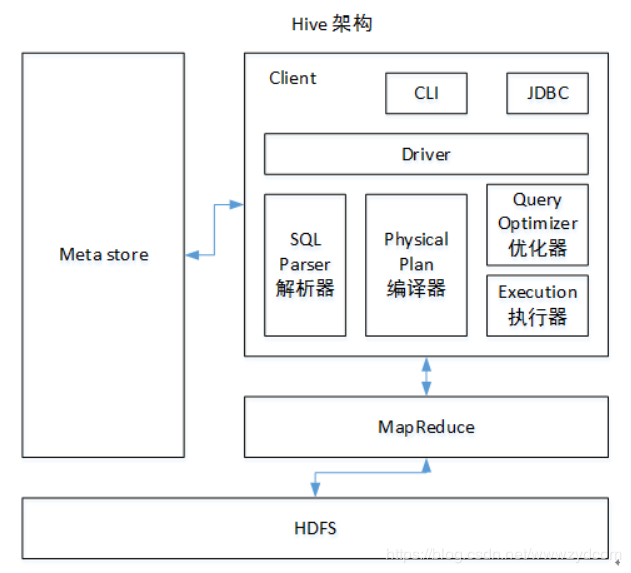
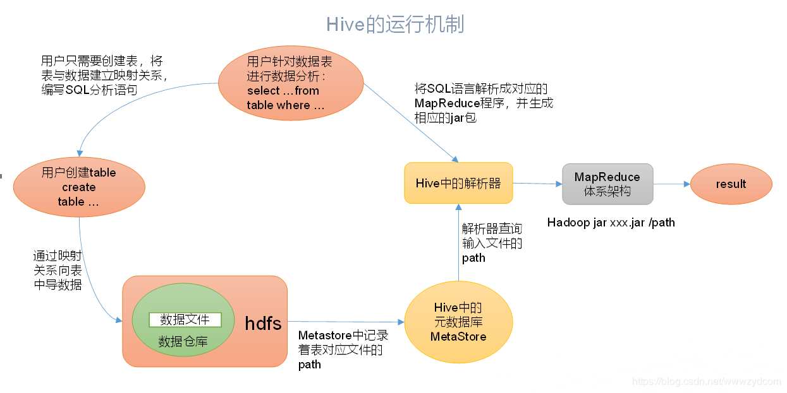

# 大数据开发工程师

## MR的shuffle阶段

1、MapTask将数据通过context.write将数据写入到环形缓冲区当中  

2、当环形缓冲区使用达到80%的时候，就会触发溢写线程，将缓冲区的数据先根据分区排序，再分区内根据Key进行排序(其实这两部都是一步)，排序完成后落到磁盘  

3、如果配置了Combiner，则进行小文件合并，一个分区一个文件  

4、reduceTask根据分区号，去对应的maptask机器上拉取文件，并将文件使用归并排序生成一个大文件，供接下来的reduce操作使用  

## HDFS为什么不适合存储大量的小文件

由于NameNode内存中存放着HDFS上所有文件的元数据信息，每个文件的元数据信息大约在150字节，所以，过多的小文件会NameNode带来很大的内存压力，使得NameNode不稳定。NameNode内存也因此限制着HDFS上存储的文件数量。

## Hadoop常用的端口号

| 组件      | 节点              | 默认端口 | 配置                                                         | 用途说明                                                     |
| --------- | ----------------- | -------- | ------------------------------------------------------------ | ------------------------------------------------------------ |
| HDFS      | DateNode          | 50010    | dfs.datanode.address                                         | datanode服务端口，用于数据传输                               |
| HDFS      | DateNode          | 50075    | dfs.datanode.http.address                                    | http服务的端口                                               |
| HDFS      | DateNode          | 50475    | dfs.datanode.https.address                                   | http服务的端口                                               |
| HDFS      | DateNode          | 50020    | dfs.datanode.ipc.address                                     | ipc服务的端口                                                |
| HDFS      | NameNode          | 50070    | dfs.namenode.http-address                                    | http服务的端口                                               |
| HDFS      | NameNode          | 50470    | dfs.namenode.https-address                                   | https服务的端口                                              |
| HDFS      | NameNode          | 8020     | fs.defaultFS                                                 | 接收Client连接的RPC端口，用于获取文件系统metadata信息。      |
| HDFS      | journalnode       | 8485     | dfs.journalnode.rpc-address                                  | RPC服务                                                      |
| HDFS      | journalnode       | 8480     | dfs.journalnode.http-address                                 | HTTP服务                                                     |
| HDFS      | ZKFC              | 8019     | dfs.ha.zkfc.port                                             | ZooKeeper FailoverController，用于NN HA                      |
| YARN      | ResourceManage    | 8032     | yarn.resourcemanager.address                                 | RM的applications manager(ASM)端口                            |
| YARN      | ResourceManage    | 8030     | yarn.resourcemanager.scheduler.address                       | scheduler组件的IPC端口                                       |
| YARN      | ResourceManage    | 8031     | yarn.resourcemanager.resource-tracker.address                | IPC                                                          |
| YARN      | ResourceManage    | 8033     | yarn.resourcemanager.admin.address                           | IPC                                                          |
| YARN      | ResourceManage    | 8088     | yarn.resourcemanager.webapp.address                          | http服务端口                                                 |
| YARN      | NodeManager       | 8040     | yarn.nodemanager.localizer.address                           | localizer IPC                                                |
| YARN      | NodeManager       | 8042     | yarn.nodemanager.webapp.address                              | http服务端口                                                 |
| YARN      | NodeManager       | 8041     | yarn.nodemanager.address                                     | NM中container manager的端口                                  |
| YARN      | JobHistory Server | 10020    | mapreduce.jobhistory.address                                 | IPC                                                          |
| YARN      | JobHistory Server | 19888    | mapreduce.jobhistory.webapp.address                          | http服务端口                                                 |
| HBase     | Master            | 60000    | hbase.master.port                                            | IPC                                                          |
| HBase     | Master            | 60010    | hbase.master.info.port                                       | http服务端口                                                 |
| HBase     | RegionServer      | 60020    | hbase.regionserver.port                                      | IPC                                                          |
| HBase     | RegionServer      | 60030    | hbase.regionserver.info.port                                 | http服务端口                                                 |
| HBase     | HQuorumPeer       | 2181     | hbase.zookeeper.property.clientPort                          | HBase-managed ZK mode，使用独立的ZooKeeper集群则不会启用该端口。 |
| HBase     | HQuorumPeer       | 2888     | hbase.zookeeper.peerport                                     | HBase-managed ZK mode，使用独立的ZooKeeper集群则不会启用该端口。 |
| HBase     | HQuorumPeer       | 3888     | hbase.zookeeper.leaderport                                   | HBase-managed ZK mode，使用独立的ZooKeeper集群则不会启用该端口。 |
| Hive      | Metastore         | 9085     | /etc/default/hive-metastore中export PORT=<port>来更新默认端口 |                                                              |
| Hive      | HiveServer        | 10000    | /etc/hive/conf/hive-env.sh中export HIVE_SERVER2_THRIFT_PORT=<port>来更新默认端口 |                                                              |
| ZooKeeper | Server            | 2181     | /etc/zookeeper/conf/zoo.cfg中clientPort=<port>               | 对客户端提供服务的端口                                       |
| ZooKeeper | Server            | 2888     | /etc/zookeeper/conf/zoo.cfg中server.x=[hostname]:nnnnn[:nnnnn]，标蓝部分 | follower用来连接到leader，只在leader上监听该端口             |
| ZooKeeper | Server            | 3888     | /etc/zookeeper/conf/zoo.cfg中server.x=[hostname]:nnnnn[:nnnnn]，标蓝部分 | 用于leader选举的。只在electionAlg是1,2或3(默认)时需要        |

## Yarn的提交流程

1、client请求向RM提交任务  

2、RM返回资源提交地址与Application ID  

3、client将任务相关文件上传到指定地址，并请求运行ApplicationMaster  

4、RM将请求包装成task，放入调度队列  

5、NodeManager从RM调度队列中获取到task，并开始运行task(启动ApplicationMaster)  

## Yarn中都有什么调度器

三种：FIFO, Capacity, Fair  

默认使用的是Capacity  

### FIFO

先来的任务会优先满足任务所需的所有资源，有剩余资源的时候才会分给下一个任务，如果没剩余资源，则下一个任务等待  

优点：简单易懂，可以按照作业优先级调度  

缺点：资源利用率不高，**不允许抢占**  

### Capacity

  

  

### Fair

  

  

  


## Hive的架构

  

用户接口:Client CLI(hive shell 命令行),JDBC/ODBC(java访问hive),WEBUI(浏览器访问hive)  
元数据:Metastore:元数据包括:表名,表所属数据库(默认是default) ,表的拥有者,列/分区字段,表的类型(是否是外部表),表的数据所在目录等  
默认存储在自带的derby数据库中,推荐使用MySQL存储Metastore  
hive 使用HDFS进行存储,使用MapReduce进行计算  
驱动器:Driver  
(1)解析器(SQL Parser):将SQL字符转换成抽象语法树AST,这一步一般使用都是第三方工具库完成,比如antlr,对AST进行语法分析,比如表是否存在,字段是否存在,SQL语句是否有误  
(2)编译器(Physical Plan):将AST编译生成逻辑执行计划  
(3)优化器(Query Optimizer):对逻辑执行计划进行优化  
(4)执行器(Execution):把逻辑执行计划转换成可以运行的物理计划,对于Hive来说,就是MR/Spark  

Hive通过给用户提供的一系列交互接口，接收到用户的指令(SQL)，使用自己的Driver，结合元数据(MetaStore)，将这些指令翻译成MapReduce，提交到Hadoop中执行，最后，将执行返回的结果输出到用户交互接口。  

  


## Hive的内部表与外部表有什么区别

内部表和外部表在创建的时候稍微有一点区别：

1.默认情况下是内部表（managed table）

2.外部表（external table）创建的时候需要加上external关键字，并且需要指定位置  

3.删除内部表会直接删除元数据（metadata）及存储数据；删除外部表仅仅会删除元数据，HDFS上的文件并不会被删除；  

4.内部表数据由Hive自身管理，外部表数据由HDFS管理  

5.内部表数据存储的位置是hive.metastore.warehouse.dir（默认：/user/hive/warehouse），外部表数据的存储位置由自己指定；   

6.对内部表的修改会将修改直接同步给元数据，而对外部表的表结构和分区进行修改，则需要修复（MSCK REPAIR TABLE table_name;）  

## 常用的Hive的窗口函数

row_number()

## 数仓分层架构说一下

## Hive优化有什么经验说一下

### map端

调整数据切分大小 mapred.max.split.size

> ```sql
> 假设一个SQL任务：
> Select count(1) from popt_tbaccountcopy_meswhere pt = '2012-07-04';
> 该任务的inputdir :  /group/p_sdo_data/p_sdo_data_etl/pt/popt_tbaccountcopy_mes/pt=2012-07-04
> 共有194个文件，其中很多事远远小于128M的小文件，总大小9G，正常执行会用194个map任务。
> Map总共消耗的计算资源：SLOTS_MILLIS_MAPS= 623,020
> 
> 通过以下方法来在map执行前合并小文件，减少map数：
> set mapred.max.split.size=100000000;
> set mapred.min.split.size.per.node=100000000;
> set mapred.min.split.size.per.rack=100000000;
> set hive.input.format=org.apache.hadoop.hive.ql.io.CombineHiveInputFormat;
> 再执行上面的语句，用了74个map任务，map消耗的计算资源：SLOTS_MILLIS_MAPS= 333,500
> 对于这个简单SQL任务，执行时间上可能差不多，但节省了一半的计算资源。
> 大概解释一下，100000000表示100M, 
> set hive.input.format=org.apache.hadoop.hive.ql.io.CombineHiveInputFormat;这个参数表示执行前进行小文件合并，
> 前面三个参数确定合并文件块的大小，大于文件块大小128m的，按照128m来分隔，
> 小于128m,大于100m的，按照100m来分隔，把那些小于100m的（包括小文件和分隔大文件剩下的），
> 进行合并,最终生成了74个块。
> ```

### reduce端

指定多大数据量为一个reducer

hive.exec.reducers.bytes.per.reducer（每个reduce任务处理的数据量，默认为1000^3=1G）  

hive.exec.reducers.max（每个任务最大的reduce数，默认为999）  

> 什么情况下只有一个reduce；
>
> 　　很多时候你会发现任务中不管数据量多大，不管你有没有调整reduce个数的参数，任务中一直都只有一个reduce任务；其实只有一个reduce任务的情况，除了数据量小于hive.exec.reducers.bytes.per.reducer参数值的情况外，还有以下原因：
>
> - 没有group by的汇总，比如把select pt,count(1) from popt_tbaccountcopy_mes where pt = ‘2012-07-04’ group by pt; 写成select count(1) from popt_tbaccountcopy_mes where pt = ‘2012-07-04’; 这点非常常见，希望大家尽量改写。
> - 用了Order by
> - 有笛卡尔积。

### SQL优化

1、列裁剪  

2、分区裁剪 `hive.optimize.pruner=true`  


JVM重用  

## 发生数据倾斜怎么处理

1、**预处理数据**  

2、**过滤少数导致倾斜的key**  

3、**提高shuffle操作的并行度**  

4、**两阶段聚合（局部聚合+全局聚合）**

## Spark提交任务的时候经常用哪些参数

total-executor-cores, driver-memory, executor-memory, master, client-mode, spark.sql.parallism

## 会引起Shuffle的算子有哪些

去重，聚合，排序，重分区

## Flink与Spark streaming，Storm的区别

可以根据以下几点答：  

1、真实时处理与微批处理  

2、有状态与无状态  

3、容错  

4、背压处理

## HashMap的数据结构

1.7:  Entry，数组+链表  

1.8:  Node,TreeNode，数组+链表+红黑树  

**TreeNode中除了有维护树状结构的指针外，还有维护链表的指针，用于扩容时候的遍历**  

## StringBuffer与StringBuilder的区别

StringBuffer线程安全，StringBuilder线程不安全

**StringBuffer中维护了一个toStringCache这样一个变量，在没有调用append方法，并且调用过toString方法时，会缓存toString结果，等再次调用toString时，会先看toStringCache为不为空，不为空直接返回，省了构建String对象的过程**

## Java自带了几种线程池

5种  

CachedThreadPool  

FixedThreadPool  

ScheduledThreadPool  

newSingleThreadExecutor  

WorkStealingPool  

## 说一下垃圾回收

### 算法：

标记整理  

标记清除

复制算法  

分代算法  

### 实现-垃圾回收器：  

Serial Old  

Parallel Old

Serial New

Par New

Parallel Scavenge

CMS  

G1

