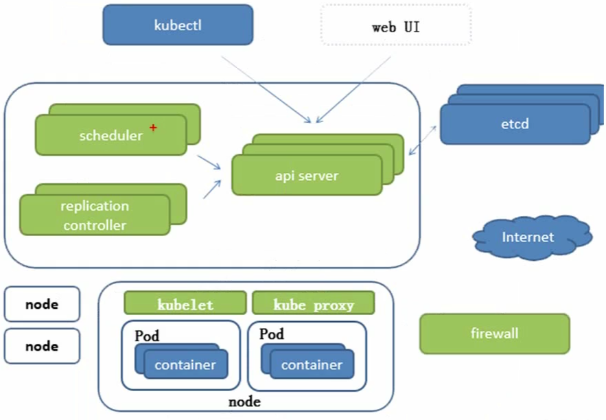
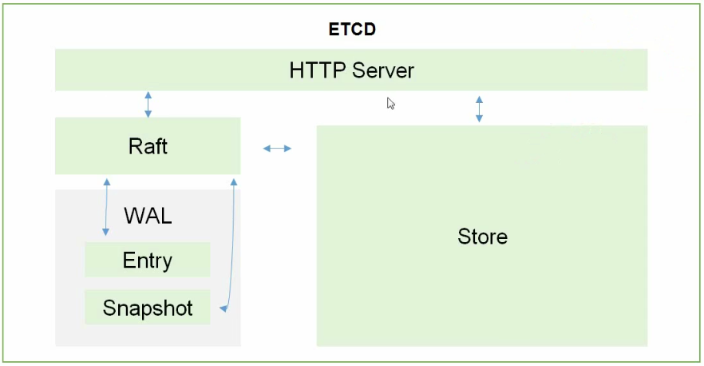

# 整体架构

  

## 组件说明

### ETCD

etcd的官方将它定位成一个可信赖的分布式键值存储服务，它能够为整个分布式集群存储一些关键数据，协助分布式集群的正常运转

  

存储K8S集群所有重要信息(持久化)  

### API SERVER

所有服务访问统一入口

### ControllerManager

维持副本期望数目

### Scheduler

负责介绍人物，选择合适的节点进行分配

### Kubelet

直接跟容器引擎交互实现容器的生命周期管理

#### Pod

有两种类型的Pod：  

1、自主性Pod  

2、控制器管理的Pod  

### Kube-proxy

负责写入规则至IPTABLES,IPVS,实现服务映射访问等

## 其他插件

### CoreDNS

可以为集群中的SVC创建一个 域名IP的对应关系解析

### DashBoard

给K8S集群提供一个B/S结构访问体系

### INGRESS Controller

官方只能实现四层代理，ingress可以实现七层代理

### Federation

提供一个可以跨集群中心多K8S统一管理功能

### Promethus

提供K8S集群的监控能力

### ELK

提供K8S日志统一接入平台