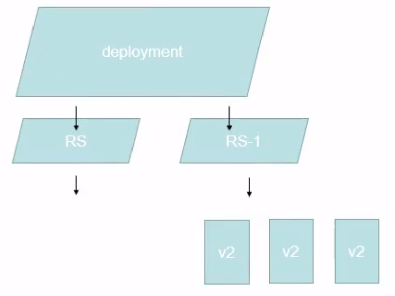
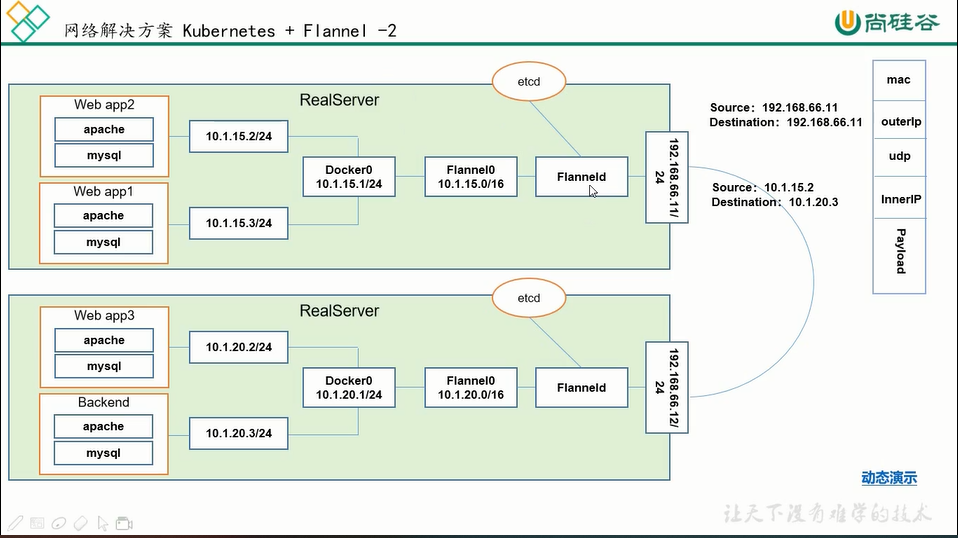
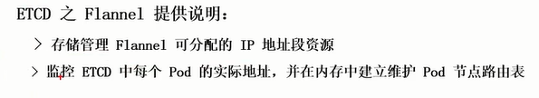
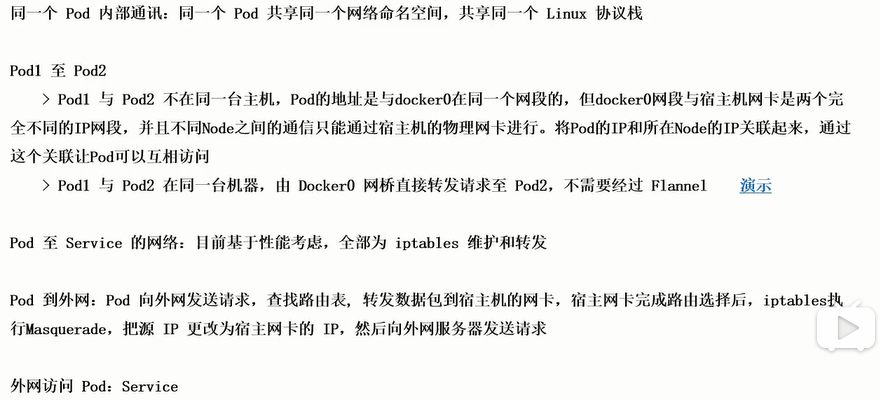
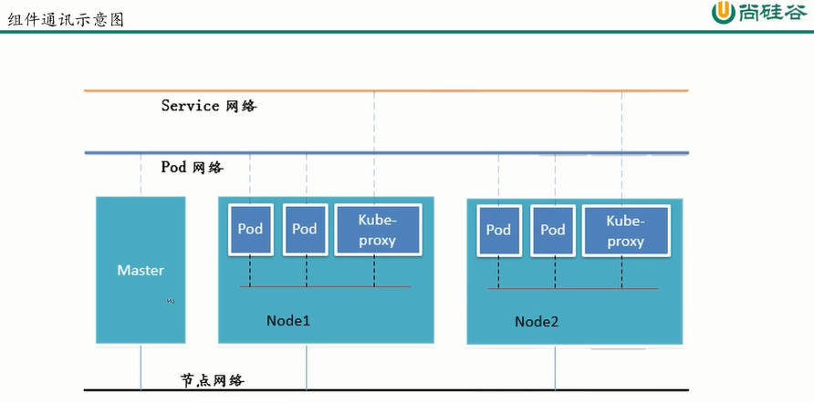

# 整体架构

  

## 组件说明

### ETCD

etcd的官方将它定位成一个可信赖的分布式键值存储服务，它能够为整个分布式集群存储一些关键数据，协助分布式集群的正常运转

  

存储K8S集群所有重要信息(持久化)  

### API SERVER

所有服务访问统一入口

### Pod控制器

#### ReplicationContsroller

用来确保容器应用的副本数始终保持在用户定义的副本数，即如果有容器异常退出，会自动创建新的pod来替代；  

而如果因为异常多出来的容器也会自动回收。  

在新版本的k8s中，建议使用ReplicaSet来取代ReplicationController  

#### ReplicaSet

ReplicaSet与ReplicationContsroller没有本质的不同，只是名字不一样。并且ReplicaSet支持集合式的selector  

#### Deployment

虽然ReplicaSet可以独立使用，但一般还是建议使用Deployment来自动管理ReplicaSet，这样就无需单行跟其他机制的不兼容问题(比如ReplicaSet不支持rolling-update但Deployment支持)    

滚动更新的实现是通过创建一个新的ReplicaSet(rs)，然后新的RS中pod逐个创建，每创建一个新的pod，旧的RS中就退出相对应的一个旧的pod，达到滚动更新的目的  

同时，当新的RS被创建启用的时候，**老的RS并不会被删除**，而是被停用，所以，当想要回滚的时候，可以以同样的方式，将旧的RS启用起来。

  

#### HPA(Horizontal Pod AutoScale)

Horizontal Pod AutoScale仅仅适用于Deployment和ReplicaSet，在V1版本中仅支持根据Pod的CPU利用率扩缩容，在V1 alpha版本中，支持根据内存和用户自定义的metric扩缩容

#### StatefeulSet

StatefeulSet是为了解决有状态服务的问题(对应Deployment和ReplicaSet是为无状态服务而设计)，其应用场景包括：  

1、稳定的持久划存储，即Pod重新调度后还是能访问到相同的持久划数据，基于PVC来实现  

2、稳定的网络标志，即Pod重新调度后其PodName和HostName不变，基于Headless Service(即没有Cluster IP的Service)来实现  

3、有序部署，有序扩展，即Pod是有顺序的，在部署或者扩展的时候要依据定义的顺序依次进行(即从0到N - 1，在下一个Pod运行之前所有的之前的Pod必须都是Running和Ready状态)基于init containers实现

4、有序收缩，有序删除(即从N - 1 到 0)

#### DaemonSet

Daemon确保全部(或者一些)Node上运行一个Pod的副本。当有Node加入集群时，也会为他们新增一个Pod。当有Node从集群移除时，这些Pod也会被回收。删除DaemonSet将会删除它创建的所有Pod  

使用DaemonSet的一些典型用法：

1、运行集群存储daemon，例如在每个Node上运行glusterd、ceph  

2、在每个Node上运行日志收集daemon，例如fluentd，logstash  

3、在每个Node上运行监控daemon，例如Promethus Node Exporter  

#### Job

Job负责批处理任务，即仅执行一次的任务，它保证批处理任务的一个或多个Pod成功结束

#### CronJob

基于时间的Job，即：  

1、在给定时间点只运行一次  

2、周期性地在给定时间点运行  

### Scheduler

负责介绍人物，选择合适的节点进行分配

### Kubelet

直接跟容器引擎交互实现容器的生命周期管理

#### Pod

有两种类型的Pod：  

1、自主性Pod  

2、控制器管理的Pod  

> 同一个pod里面的container，既共享网络栈，也共享存储卷
>
> 共享网络栈意味着两个容器之前的网络访问通过localhost即可进行，两个容器所使用的端口号不能冲突

### Kube-proxy

负责写入规则至IPTABLES,IPVS,实现服务映射访问等

## 其他插件

### CoreDNS

可以为集群中的SVC创建一个 域名IP的对应关系解析

### DashBoard

给K8S集群提供一个B/S结构访问体系

### INGRESS Controller

官方只能实现四层代理，ingress可以实现七层代理

### Federation

提供一个可以跨集群中心多K8S统一管理功能

### Promethus

提供K8S集群的监控能力

### ELK

提供K8S日志统一接入平台

## 网络通讯方式

> Kubernetes的网络模型假定了所有pod都在一个**可以直接连通的扁平的网络空间中**，这在GCE(Google Compute Engine)里面是现成的网络模型，Kubernetes假定这个网络已经存在。
>
> 而在私有云里搭建Kubernetes集群，就不能假定这个网络已经存在了。我们需要自己实现这网络假设，**将不同节点上的docker容器之间的互相访问先打通**，然后运行Kubernetes

### 网络解决方案 (Kubernetes + Flannel)

Flannel是coreOS针对Kubernetes设计的一个网络规划服务，简单来说，它的功能是让集群中的不同节点主机创建的Docker容器都具有全集群唯一的虚拟IP地址。而且它还能再这些IP地址之间建立一个覆盖网络(Overlay Network)，通过这覆盖网络，将数据包原封不动地传递到目标容器内。

  

  

目前Pod到Service的网络，现在已经可以通过LVS来进行实现，效率更高  

  

节点网络是一个物理网络。  

Service网络与Pod网络都是虚拟网络。  

Init C容器的作用

因为Init容器具有与应用程序容器分离的单独镜像，所以他们的启动代码具有如下优势：  

1、它们可以包含并运行实用工具，但是出于安全考虑，是不建议在应用程序容器镜像中包含这些实用工具的  

2、它们可以包含使用工具和定制化代码来安装，但是不能出现在应用程序镜像中。例如，创建镜像没必要FROM另一个镜像，只需要在安装过程中使用类似sed,awk,python或者dig这样的工具。  

3、应用程序镜像可以分离出创建和部署角色，而没有必要联合它们构建一个单独的镜像。  

4、Init容器使用Linux Namespace。所以相对应用程序容器来说具有不同的文件系统视图。因此，它们能够具有方位Secret的权限，而应用程序则不能。  

5、它们必须在应用程序容器启动之前运行完成，而应用程序容器是并行运行的，所以Init容器能够提供一种简单的阻塞或延迟应用容器启动的方法，直到满足了一组先决条件

特殊说明  

在Pod启动过程中，Init容器会按顺序在网络和数据卷初始化之后启动。每个容器必须在下一个容器启动之前成功退出  

如果由于运行时或失败退出，将导致容器启动失败，它会根据颇多的restartPolicy指定的策略进行重试。然后，如果pod的restartPolicy设置为Always，Init容器失败时会使用restartPolicy策略  

在所有的Init容器没有成功之前，Pod将不会变成ready状态。Init容器的端口将不会在Service中进行聚集。正在初始化中的Pod处于Pending状态，但应该会将Initializing状态设置为true  

如果Pod重启，所有的Init容器必须重新执行  

