# 数仓

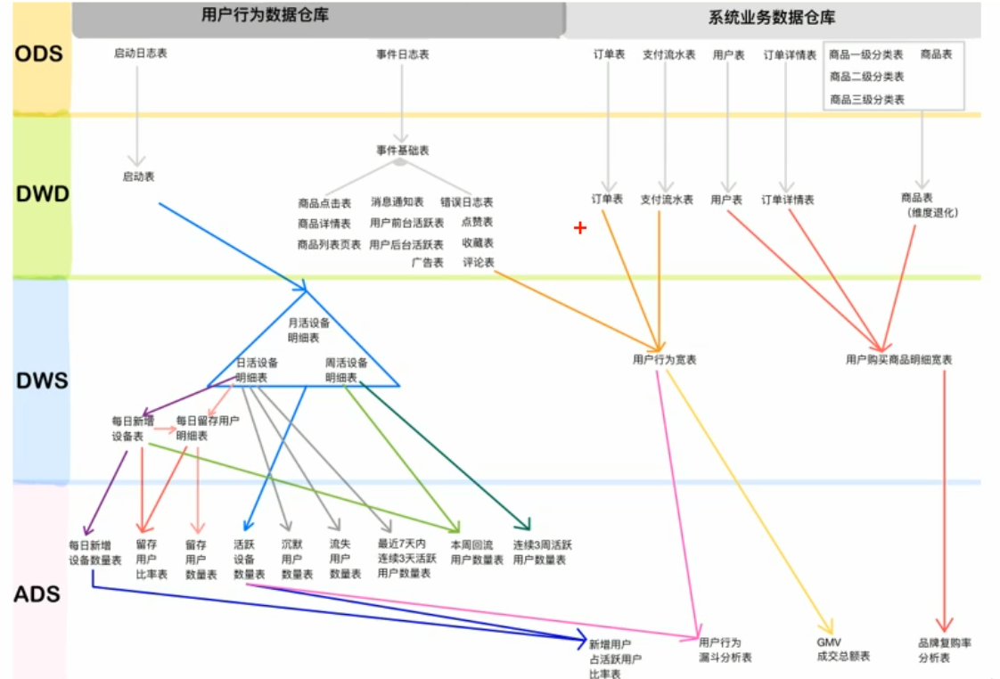  

## 系统数据流程设计

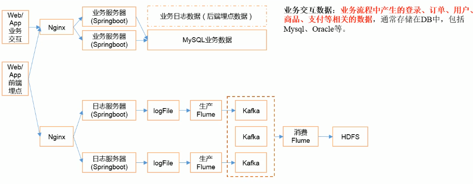

## HDFS参数调优

1、dfs.namenode.handler.count = 20*log2(cluster size)

> NameNode有一个工作线程池，用来处理不同DataNode的并发心跳以及客户端并发的元数据操作。对于大集群或者有大量客户端的集群来说，通常需要增大参数dfs.namenode.handler.count,其默认值为10.设置该值的一般原则是将其设置为集群大小的自然对数乘以20，即20log(N),N为集群大小

2、编辑日志存储路径dfs.namenode.edits.dir设置与镜像文件存储路径dfs.namenode.name.dir尽量分开，达到最低写入延迟。

## Flume HDFS小文件处理

官方默认的这三个参数配置写入HDFS后会产生小文件，hdfs.rollInterval、hdfs.rollSize、hdfs.rollCount  

基于以上hdfs.rollInterval=3600, hdfs.rollSize=134217728, hdfs.rollCount=0, hdfs.roundValue=10, hdfs.roundUnit=second几个参数综合作用，效果如下：  

1. tmp文件在达到128M时会滚动生成正式文件

2. tmp文件创建超过10秒时会滚动生成正式文件

举例：在2018-01-01 05:23的时候sink接收到数据，那会产生如下tmp文件：/path/to/save/201801010520.tmp

即使文件内容没有达到128M，也会在05:33时滚动生成正式文件  

# 数仓概念

## 数仓为什么要分层

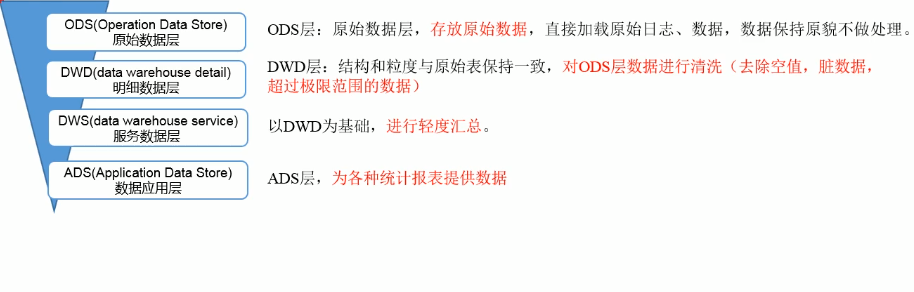  

**1、把复杂的问题简单化**  

将一个复杂的任务分解成多个步骤来完成，每一层只处理单一的步骤，比较简单、并且方便定位问题。  

**2、减少重复开发**  

规范数据分层，通过中间层数据，能够减少极大的重复计算，增加一次计算结果的复用性。  

**3、隔离原始数据**  

不论是数据的异常还是数据的敏感性，使真实数据与统计数据解耦开  

## 分层

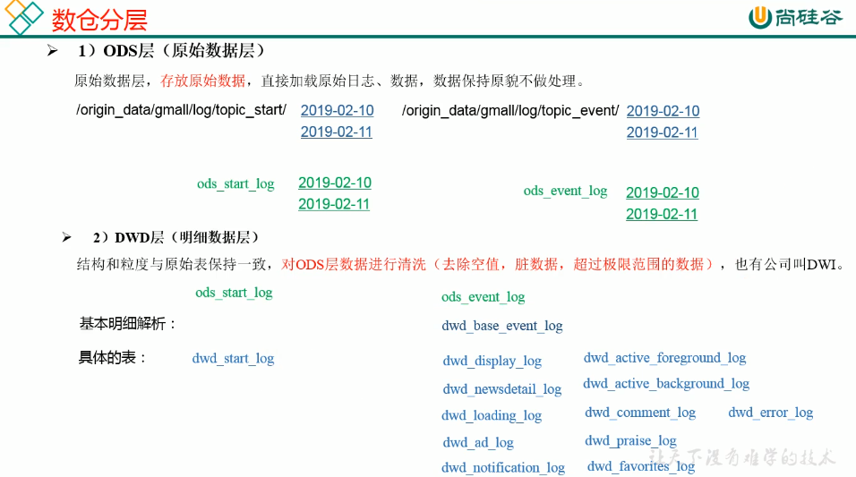  

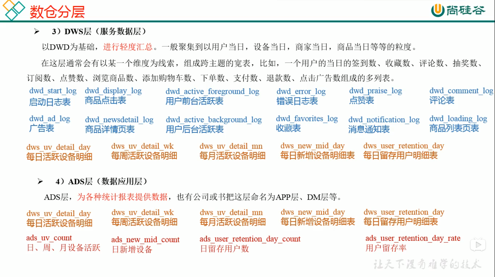

## 数据集市的概念

## 数据集市与数据仓库的区别

**数据集市(Data Market) 是一种微型的数据仓库**，它通常有更少的数据，更少的主题区域，以及更少的历史数据，因此是**部门级**的，一般只能为某个局部范围内的管理人员服务。  

**数据仓库是企业级的**，能为整个企业各部门的运行提供决策支持手段。  

## 数仓命名规范

ODS层命名为ods  

DWD层命名为dwd  

DWS层命名为dws  

ADS层命名为ads  

临时表数据库命名为xxx_tmp  

备份数据数据库命名为xxx_bak  

## 表的分类

### 实体表

一般是指一个现实存在的业务对象，比如用户、商品、商家、销售员等等  

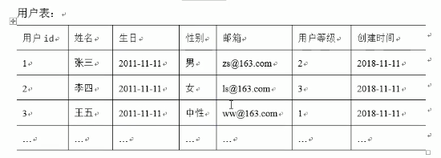  

### 维度表

一般是指对应一些业务状态，编号的解释表。也可以称之为码表。  

比如地区表，订单状态，支付方式。审批状态，商品分类等等  

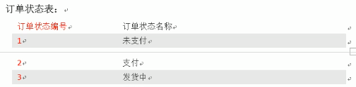  

### 事务性事实表

一般指随着业务发生不断产生的数据。特点是一旦发生不会再变化。比如，交易流水，操作日志，出库入库记录等等  

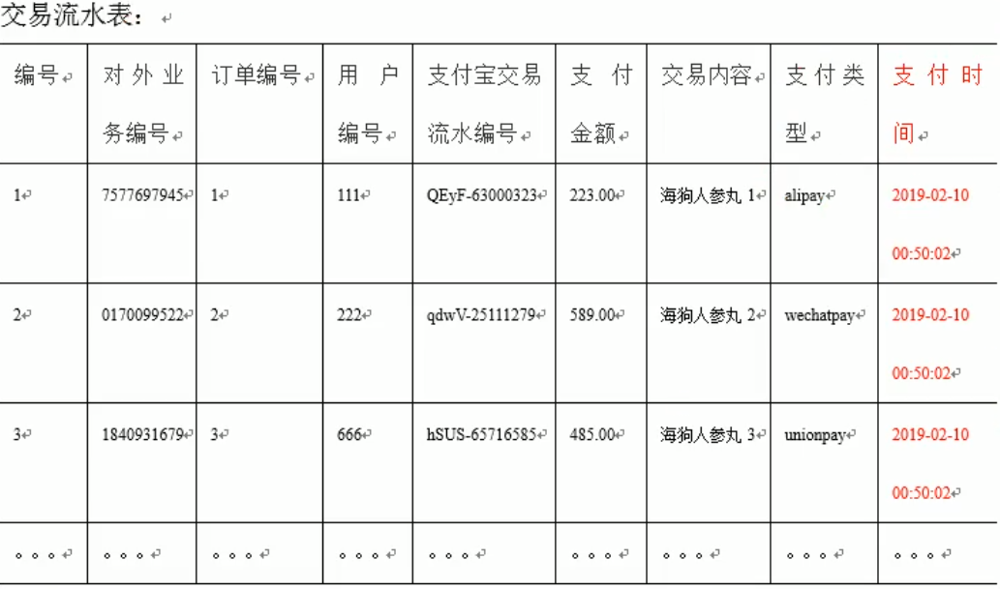  

### 周期型事务表

一般指随着业务发生，不断产生的数据。  

与事务型不同的是，数据会随着业务周期性的推进而变化。  

比如订单，其中的订单状态会周期变化。再比如，请假、贷款申请，随着批复状态在周期性的变化。  

  

## 表同步策略

数据同步策略的类型包括：**全量表、增量表、新增及变化表、拉链表**

全量表：存储完整的数据  

增量表：存储新增加的数据  

新增及变化表：存储新增加的数据和变化的数据  

拉链表：对新增及变化表做定期合并  

### 实体表同步策略

实体表：比如用户，商品，商家，销售员等  

实体表数据量比较小，通常可以做每日全量，就是每天存一份完整数据。**即每日全量**

### 维度表同步策略

维度表：比如订单状态，审批状态，商品分类  

维度表数据量比较小，通常可以做每日全量，就是每天存一份完整数据。**即每日全量**   

说明：  

1. 针对可能会有变化的状态数据可以存储每日全量  

2. 没变化的客观世界的维度(比如性别，地区，民族，政治成分，鞋子尺码)可以存一份固定值

### 事务型事实表同步策略

事务型事实表：比如，交易流水，操作日志，出库入库记录等  

因为数据不会变化，而且数据量巨大，所以每天只同步新增数据即可，所以可以做成**每日增量表，即每日创建一个分区存储**

### 周期型事实表同步策略

周期型事实表：比如订单。请假。贷款申请等  

这类表从数据量的角度，存每日全量的话，数据量太大，冗余也太大。如果用每日增量的话无法反应数据变化。  

**每日新增及变化量**，包括了当日的新增和修改。一般来说这个表，足够计算大部分当日数据的。但是这种依然无法解决能够得到某一个历史时间点(时间切片)的切片数据。  

所以要利用每日新增和变化表，制作一张拉链表，以方便的取到某个时间切片的快照数据。所以我们需要得到每日新增及变化量。

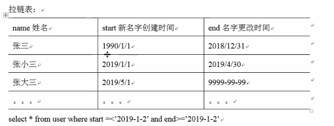  

## 拉链表

### 什么是拉链表

拉链表，记录每条信息的生命周期，一旦一条记录的生命周期结束，就重新开始一条新的记录，并把当前日期放入生效开始日期。  

如果当前信息至今有效，在生效结束日期中填入一个极大值(如9999-99-99)  

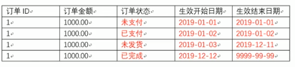  

### 为什么要做拉链表

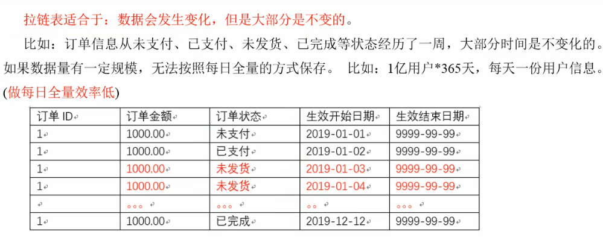  

### 如何使用拉链表

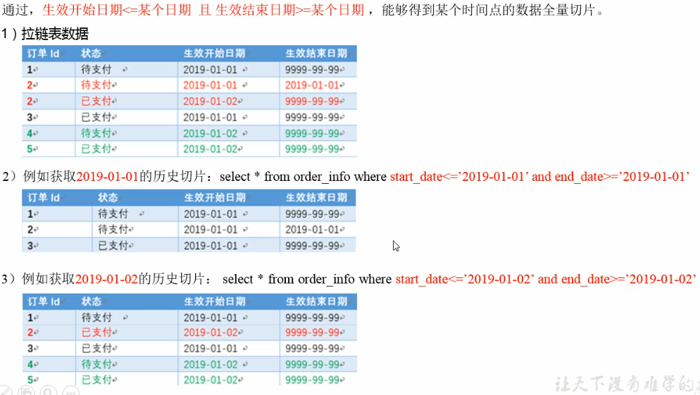  

### 拉链表形成过程

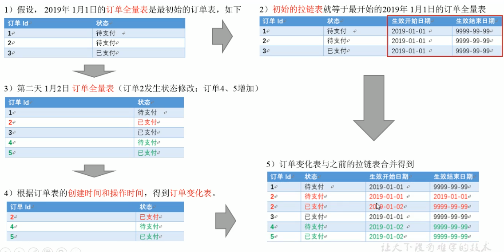  

### 拉链表制作流程图

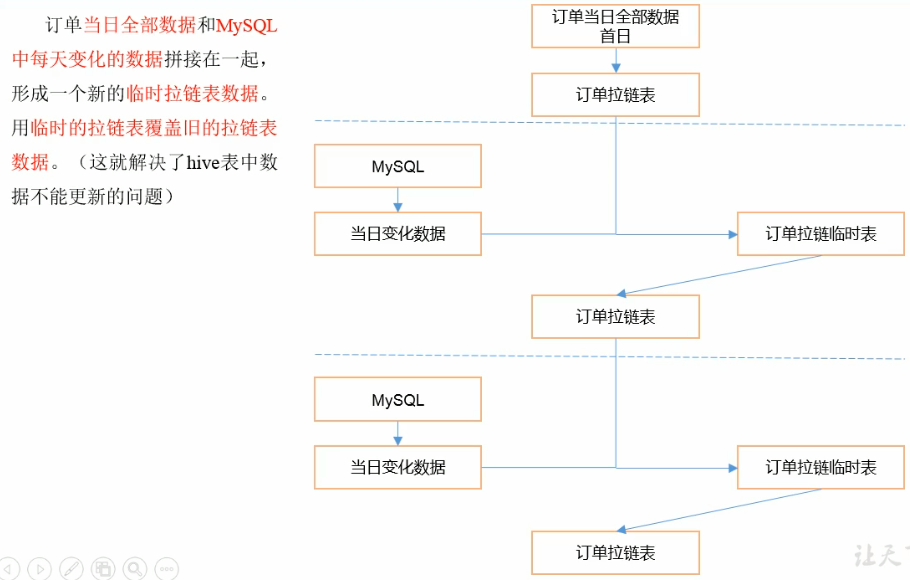  

## 范式理论

### 范式概念

关系型数据库设计时，遵照一定的规范要求，目的在于降低数据的冗余性，目前业界范式有：第一范式，第二范式，第三范式，巴斯-科德范式(BCNF)，第四范式，第五范式。  

范式可以理解为一张数据表的表结构，符合的设计标准的级别  

使用范式的根本目的是：

1. 减少数据冗余，尽量让每个数据只出现一次。

2. 保证数据一致性

缺点是获取数据时，需要通过join拼接出最后的数据

### 函数依赖

  

#### 完全函数依赖
比如通过**(学号，课程)推出分数**，但是**单独用学号推断不出来分数**，那么就可以说：分数**完全依赖**于(学号，课程)  

即：通过AB能得出C，但是AD单独得不出C，那么说C完全依赖于AB。  

#### 部分函数依赖

比如(学号，课程)推出姓名，因为其实直接可以通过学号推出姓名，所以：姓名部分依赖于(学号，课程)  

即：通过AB能得出C，通过A也能得出C，或者通过B也能推出C，那么说C部分依赖于AB  

#### 传递函数依赖

比如：学号推出系名，系名推出系主任，但是，系主任推不出学号，系主任主要依赖于系名。这种情况可以说：系主任传递依赖于学号。  

### 第一范式

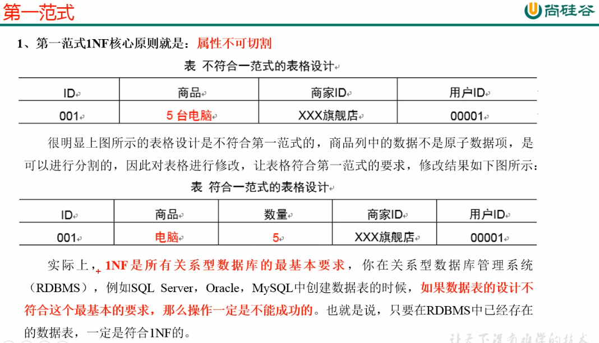  

### 二范式

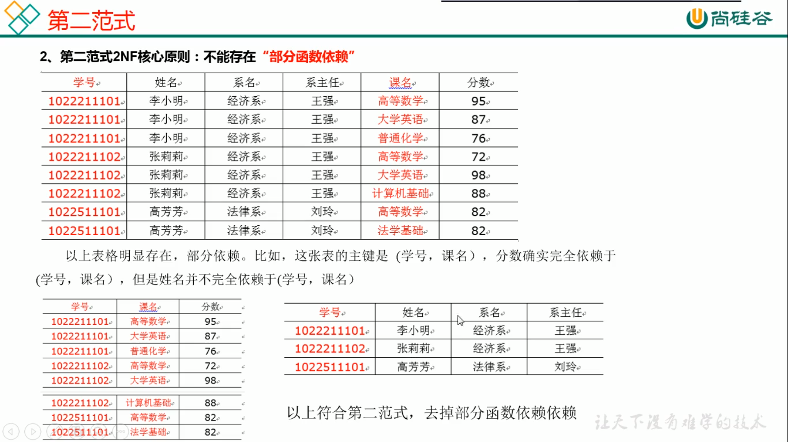  

### 第三范式

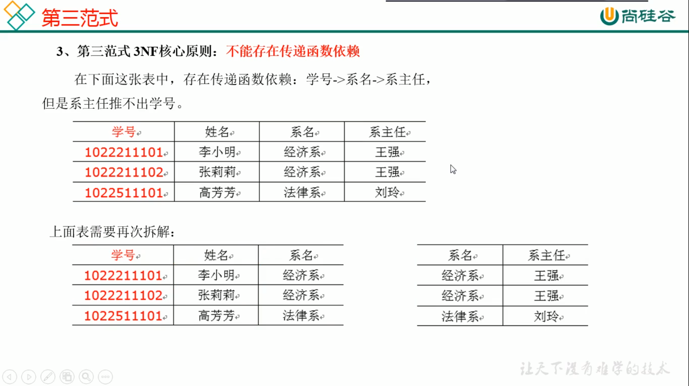  

## 关系建模与维度建模

关系建模主要应用于OLTP系统中，为了保证数据的一致性以及避免冗余，所以大部分业务系统的表都是遵循第三范式的。  

维度模型主要应用于OLAP系统中，因为关系模型虽然冗余少，但是在大规模数据的跨表分析统计查询过程中，**会造成多表关联，这会大大降低执行效率**。  

## 数仓三种模型

在维度建模的基础上，又分为三种模型：星型模型，雪花模型，星座模型

  

### 星型模型

星型模型与雪花模型的区别主要在于维度的层级，标准的星型模型维度只有一层，而雪花模型可能会涉及多级。  

### 雪花模型

雪花模型比较靠近3NF，但是无法完全遵守，因为遵循3NF的性能成本太高了  

### 星座模型

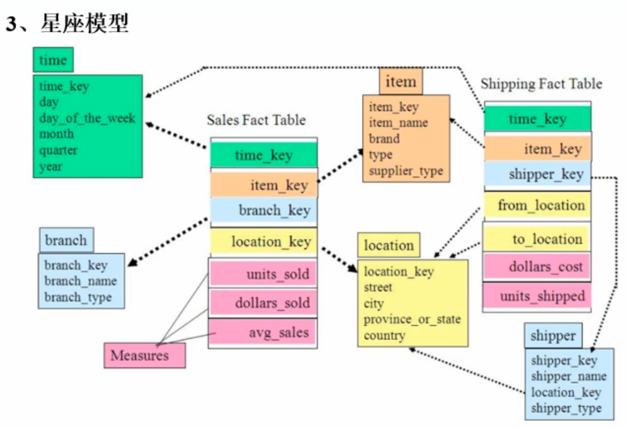  

**星座模型与前两个情况的区别是事实表的数量，星座模型是基于多个事实表**  

基本上是很多数据仓库的常态，因为很多数仓都是多个事实表。所以星座不只是反映是否有多个事实表，他们之间是否共享一些维度表。  

所以星座模型并不和前两个模型冲突。  

### 模型的选择

首先就是星座模型只跟数据和需求有关系，跟设计没关系，不用选择  

星型还是雪花，取决于**性能优先**还是**灵活优先**。

目前实际企业开发中，不会绝对选择一种，根据情况灵活组合，甚至并存(一层维度和多层维度都保存)。但是整体来看，**更倾向于维度更少的星型模型**。尤其是Hadoop体系，减少join就是减少shuffle，性能差距很大。(关系型数据库可以依靠强大的主键索引)

# Sqoop相关面试问题

## 数据导出一致性问题

如Sqoop在导出Mysql时，使用4个Map任务，过程中有2个任务失败，那此时MySQL中存储了另外两个Map任务导入的数据，此时老板正好看到了这个报表数据。而开发工程师发现任务失败后，会调试问题并最终将全部数据正确的导入MySQL，那后面老板再次看待报表数据，发现本次看到的数据与之前的不一致，这在生产环境是不允许的 。  

此时Sqoop支持使用`--staging-table`的方式，先将数据导入到临时表，等全部map任务完成后，再将临时表的数据写入到正式表当中，导入成功之后，如果要清除临时表，则可以使用`--clear-staging-table`参数。  

> Sqoop运行的任务只有Map任务，没有Reduce阶段的任务