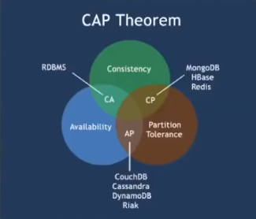
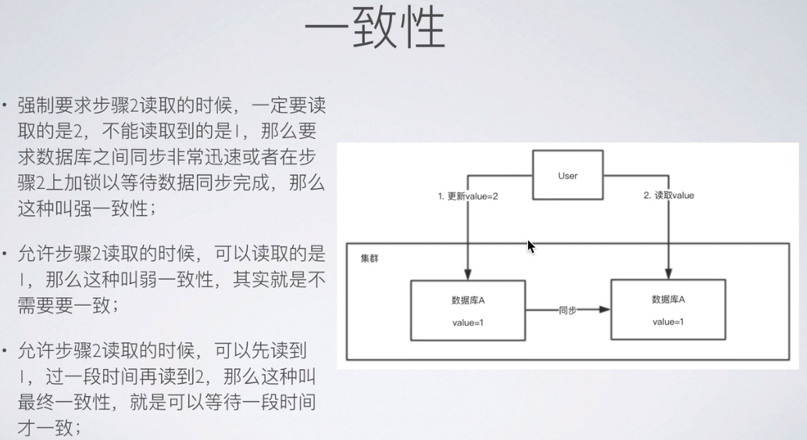
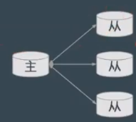
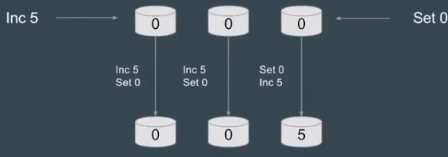
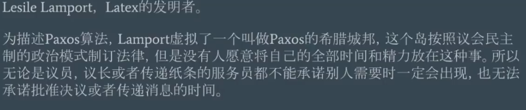
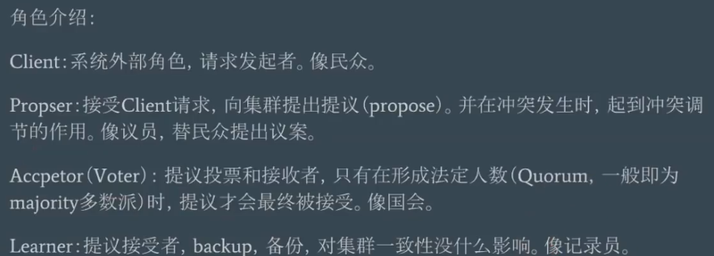
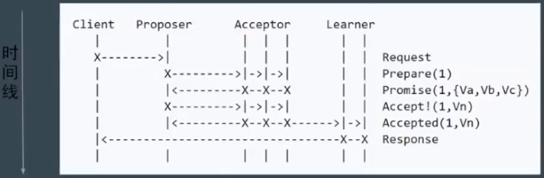
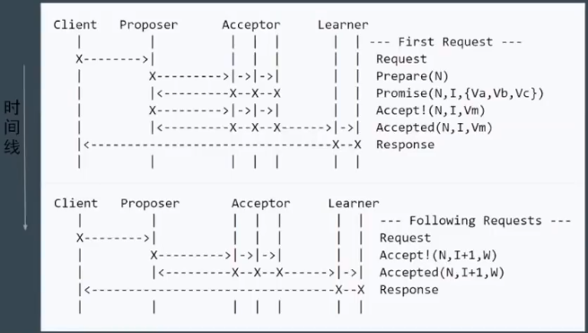
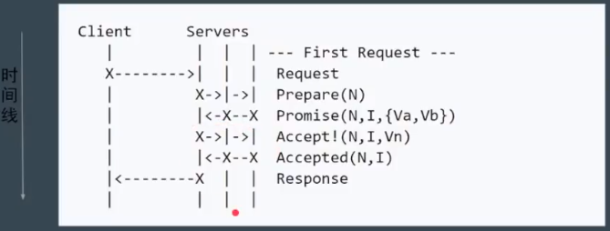

# CAP理论

  

对于一个分布式系统，不能同时满足以下三点：  

一致性(Consistency)  

可用性(Availability)  

分区容错性(Partition Tolerance)

## 一致性

## 分区容错性

分区容错性指，即分布式系统在遇到某节点或网络分区故障的时候，仍然能够对外提供满足一致性和可用性的服务。  

分区容错性和扩展性紧密相关。在分布式应用中，可能因为一些分布式的原因导致系统无法正常运转。好的分区容错性要求鞥能够使应用虽然是一个分布式系统，而看上去却好像是在一个可以运转正常的整体。比如想在的分布式系统中有某一个或者几个机器宕机了，其他剩下的机器还能够正常运转满足系统需求，或者是机器之间有网络异常，将分布式系统分隔为独立的几个部分，各个部分还能维持分布式系统的运作，这样就具有良好的分区容错性。  

# Base理论

## 基本可用(Basically Available)

基本可用是指分布式系统在出现故障的时候，允许损失部分可用性，既保证核心可用。电商大促时，为了应对访问量激增，部分用户可能会被引导到降级页面，服务层也可能只提供降级服务，这就是损失部分可用性的体现。  

## 软状态(Soft State)

软状态是指允许系统存在中间状态，而该中间状态不会影响系统整体可用性。分布式存储中一般一份数据至少会有3个副本，允许不同节点间副本同步的眼石就是软状态的体现。mysql replication的异步复制也是一种体现。  

## 最终一致性(Eventual Consistency)

最终一致性是指系统中的所有数据副本经过一定时间后，最终能够达到一致的状态。弱一致性和强一致性相反，最终一致性是弱一致性的一种特殊形式情况。  

# 一致性模型  

## 弱一致性模型

最终一致性，例如DNS，Gossip(Cassandra的通信协议)  

写一条记录，在另外的节点上不能马上读到，但是经过一定时间之后是能读到的。

## 强一致性模型

Paxos，Raft，ZAB

## 理论

### 主从同步

  

主从同步复制  

1、Master接受写请求  

2、Master复制日志到Slave  

3、Master等待，直到所有从库返回  

**问题** ：

一个节点失败，Master阻塞，导致整个集群不可用，保证了一致性，可用性却大大降低  

### 多数派

每次写都保证写入大于N / 2个节点，每次读保证从大于N / 2 个节点中读  

**问题**：  

 在并发环境下，无法保证系统正确性，顺序非常重要  

  

## 实现

### Paxos

**basic Paxos**  
  

  
**步骤**

1、Prepare

> proposer提出一个提案，编号为N，此N大于这个proposer之前提出的提案编号。请求accceptors的quorum接受。

2、Promise

> 如果N大于此acceptor之前接受的任何提案编号则接受，否则拒绝

3、Accept

> 如果达到了多数派，proposer会发出accept请求，此请求包含提案编号N，以及提案内容

4、Accepted

> 如果此acceptor在此期间没有收到任何编号大于N的提案，则接受此提案内容，否则忽略

  

**问题**  

难以实现、效率低(需要两轮RPC)、存在活锁。  

活锁：  

**Multi Paxos**  

  

减少了角色，进一步简化。

  

核心思想就是，所有提案都由一个proposer提出，在First Request中，选举出能够发出提案的proposer

**Fast Paxos**

### Raft

将一致性问题划分成了三个子问题：

1、Leader Election  

2、Log Replication  

3、Safety  

### ZAB

