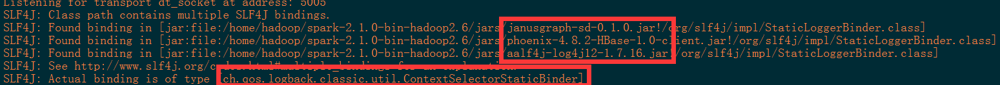
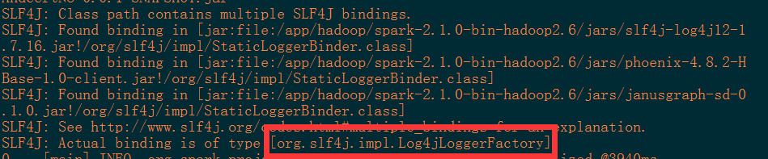

# 宿主机部分
## 已有镜像介绍
hadoop_base: 大数据单节点基础镜像，已安装alluxio-1.4.0，hive-1.2.1，hadoop-2.6.0，hbase-1.0.2，kafka_2.10-0.8.2.0，spark-2.1.0-bin-hadoop2.6，zookeeper-3.4.6
jdk7 : 安装jdk7的基础镜像，jdk1.7.0_79
jdk8:安装jdk8的基础镜像，jdk1.8.0_201
df_centos6_base：已配置好阿里云yum源的基础镜像，以上镜像由该镜像产生
## Build镜像
> 本宿主机docker所使用的镜像都由dockerfile产生，基础镜像为centos 6
### Dockfile 介绍
dockfile是一个用于编写docker镜像生成过程的文件，其有特定的语法。
#### From 命令
**用法：** FROM  < image >  
第一个指令必须是FROM，其指定一个构建镜像的基础源镜像，如果本地没有就会从公共库中拉取，没有指定镜像的标签会使用默认的latest标签，可以出现多次，如果需要在一个Dockerfile中构建多个镜像
#### USER 命令
**用法：** USER < 用户名 >  
指定运行容器时的用户名或UID，后续的RUN、CMD、ENTRYPOINT也会使用指定的用户运行命令。  
#### WORKDIR 命令
**用法：** WORKDIR < 路径 >  
设置工作命令，作用效果与shell命令中的cd相同
#### RUN 命令
**用法：**RUN "command" "param1" "param2"  
RUN命令是一个常用的命令，执行完成之后会成为一个新的镜像，这里也是指镜像的分层构建。一句RUN就是一层，也相当于一个版本。这就是之前说的缓存的原理。我们知道docker是镜像层是只读的，所以你如果第一句安装了软件，用完在后面一句删除是不可能的。所以这种情况要在一句RUN命令中完成，可以通过&符号连接多个RUN语句。RUN后面的必须是双引号不能是单引号（没引号貌似也不要紧），command是不会调用shell的，所以也不会继承相应变量，要查看输入`RUN "sh" "-c" "echo" " $HOME"`，而不是`RUN "echo" "$HOME"`  
#### ADD 命令
**用法：**ADD < src > < dest >  
将物理机中的文件放入容器中，如果文件为压缩文件(例如tar.gz)，则会自动解压后放入目标目录中
#### ENV 命令
**用法：**ENV < key > < value >  
设置build时的环境变量，注意！此环境变量不会写入/etc/profile中，attach容器，docker exec进入时有效，ssh登录无效  
```
FROM jdk7:1
USER hadoop
WORKDIR /home/hadoop
ADD software/dig.tar.gz /home/hadoop
RUN mkdir -p /home/hadoop/appData/hadoop/data/dfs/data
RUN mkdir -p /home/hadoop/appData/hadoop/data/dfs/journal
RUN mkdir -p /home/hadoop/appData/hadoop/data/dfs/name
RUN mkdir -p /home/hadoop/appData/zookeeper/logs
RUN mkdir -p /home/hadoop/appData/zookeeper/data
USER root
RUN cat /home/hadoop/hosts > /etc/hosts
RUN cat /home/hadoop/profile > /etc/profile
RUN echo "*          soft    nproc     10240" >> /etc/security/limits.d/90-nproc.conf
RUN echo "root       soft    nproc     unlimited" >> /etc/security/limits.d/90-nproc.conf
RUN chown -R hadoop:hadoop /home
RUN chmod 755 -R /home
WORKDIR /home/hadoop
```
#### 还有一些命令未用到，暂不予介绍
### Build镜像命令
在dockerfile所在目录，执行`docker build -t imagename:version -f dockerfile-name .`  
imagename:version -> 生成的镜像的名字与版本  
dockerfile-name -> dockerfile文件名  
如果中途执行失败，可以在修改正确dockfile之后再次执行此命令，可以从上次中断的地方继续编译
### 一些小的问题
1、docker默认的磁盘模式overlay不支持storage-opt参数，也就是说不支持自定义容器中的磁盘大小，可通过制定docker的磁盘模式为devicemapper
编辑/etc/docker/daemon.json 文件，如果不存在则创建。在json数组中写入"storage-driver": "devicemapper"。完整的daemon.json如下  
2、docker 默认的容器与镜像存放路径为/var/lib/docker ，如要修改，可以在/etc/docker/daemon.json中加入graph参数来制定存放位置，如下文件所示  
```json
{"registry-mirrors": ["http://7e61f7f9.m.daocloud.io"],"graph": "/home/hadoop/docker","storage-driver": "devicemapper"}
```  
> 注意：更改镜像存放位置，以及更改磁盘模式，会导致原有镜像和容器 **丢失**，操作前可使用docker export 或docker save将容器导出
##docker-compose容器编排
> **注意，严禁使用docker-compose中的down命令，此命令会删除编排组中的所有容器**
###docker-compose.yml
```
version: '2.4'
services:
  reserved3:
    image: jdk8:1
    container_name: reserved3
    tty: true
    network_mode: "none"
    mem_limit: 7G
    cpuset: 0,2
    hostname: reserved3
    storage_opt:
      size: '63G'
    volumes:
      - /opt/hosts:/root/dockerfile/hosts:ro
      - /etc/localtime:/etc/localtime:ro
```
文件由version:'2.4'开头  
services下的每个一级标签都是一个容器定义，注意空格对齐  
1、reserved3是一个容器的服务名  
2、image 指明该容器使用的是什么镜像，注意冒号后必须有一个空格  
3、container_name 制定容器的名称  
4、tty 后台运行需要  
5、network_mode制定网络模式，由于本宿主机分配网络使用的是pipework，所以此处为none  
6、mem_limit 设置容器内存使用限制，最大7G  
7、cpuset 设置容器CPU相关性，本容器只能在CPU-0和CPU-2上运行  
8、hostname 指定主机名，注意：此选项不会更改/etc/sysconfig/network下的hostname  
9、storage_opt的size，设置容器可使用的最大磁盘容量  
10、volumes 将宿主机的文件挂载在容器中，供容器访问  
###docker-compose命令介绍
#### docker-compose up
编排组中如果容器不存在则创建，然后启动，如果docker-compose文件被修改了，则会删除改动的容器并重新生成  
#### docker-compose down
关闭编排组中的容器并删除！
#### docker-compose start
启动编排组中的容器  
#### docker-compose stop
停止编排组中的容器  

> 以上命令都能在后面附带容器名，从而实现对单个容器进行操作

## 启动容器
使用启动脚本`/root/shells/start-contain-all.sh`
## 停止容器
docker stop 容器名  

> 容器重启后会丢失IP，以及ssh服务处于停止状态，IP分配使用`pipework br0 容器名 容器IP/24@192.168.1.1`
ssh服务启动使用`docker exec 容器名 sh -c "service sshd start"`
> dockerfile 位于/root/dockerfile之中 
> docker-compose位于/root/docker-compose中

# 容器部分
## hadoop1 - hadoop5脚本介绍
脚本位于/home/hadoop/shells文件夹下  
1、k.sh 批量免密登录脚本  
2、remote-exec.sh 远程执行脚本,此脚本接受3个参数，依次为需要执行的机器号 1 -> 5(多个机器号空格分割)，执行用户，执行命令  
例如：`/home/hadoop/shells/remote-exec.sh "1 2 3 4 5" "hadoop" "jps"`   
3、start-cluster.sh 启动集群，直接执行，会依次启动hdfs zookeeper hmaster regionserver kafka spark-master spark-slaver  
4、start-service.sh 启动单个服务，参数为需要启动的服务名[master,zookeeper,regionserver,kafka,spark-master,spark-slaver,namenode,datanode,journalnode]  
5、stop-service.sh 停止单个服务，参数同start-service  
6、stop-cluster.sh 停止集群，直接执行  

## 目录介绍
1、软件都装于/home/hadoop中  
2、宿主机的host文件挂载于/root/dockfile/hosts目录中，与宿主机hosts保持同步  
3、宿主机localtime文件挂载于/etc/localtime ，用于与宿主机时间保持同步  
4、hdfs，zookeeper，mysql数据文件都保存在/home/hadoop/appData目录中  
## 新添加容器
1、新添加容器后，在/root/docker-compose/hostname.log中添加相应的IP记录，然后使用start-comtainer-specifically.sh脚本进行启动，即可分配好之前写入hostname.log的IP并启动sshd服务  
# 异常处理
可以在任意一台服务器上使用`/home/hadoop/shells/remote-exec.sh "1 2 3 4 5" "hadoop" "jps"`来检查服务是否存活  
## 某个节点服务停止
如果有节点服务宕机，可以使用remote-exec.sh去远程执行start-service.sh脚本来启动停止的服务  
例如：`/home/hadoop/shells/remote-exec.sh "3" "hadoop" "/home/hadoop/shells/start-service.sh datanode"`  
如果需要格式化namenode，则需要先启动journalnode，再格式化namenode，再启动集群  

## 宿主机完全断电重启
先启动docker：`service docker start`  
再执行`/root/shells/start-contain-all.sh`  

## 单个容器宕机
使用 start-container-specifically.sh脚本进行重启，此脚本接收一个参数，容器名称  
例如: `./start-comtainer-specifically.sh hadoop1`  

## ssh登录立即出现Connection to 主机名 closed.或者Xshell登录卡死
检查欲登录主机的/etc/security/limits.d/90-nproc.conf文件中是否配置以下内容
```
*          soft    nproc     10240
root       soft    nproc     unlimited
```

# 番外
## spark中jar的加载顺序不一致导致的输出日志等级配置失效的问题  
### 背景
spark的jars目录存放着spark所依赖的jar包，本集群的spark组件是从上一个老集群直接copy过来，修改了配置文件之后直接使用  
### 问题描述
当执行spark-submit的时候，发现有大量的debug等级的日志输出在控制台，但是，在conf目录的log4j.properties文件中`log4j.rootCategory=WARN, console`已经设置为了warn级别，但是看起来似乎并未生效。  
### 分析
由于本组件是直接copy然后改配置文件的，但是有关日志的配置文件并未改动过，常理来说应该与老集群的输出效果保持一致的。再仔细观察输出的日志，发现日志的第一行提示了检测到了多个slf4j binding的存在，这时，与老集群上日志输出的Found binding顺序有不一致的现象，由于日志框架会选择首个加载的binding 作为loggerfactory，而我们需要的是spark组件本身所依赖的slf4j-log4j12这个jar包中所提供的log4jLogFactory，所以，问题所在就是jvm中jar的加载顺序问题。 


jvm读取linux文件，是按照文件inode号的顺序进行读取的，而不是按照文件名的字典序，一般来说直接批量copy写入的文件都是按照文件名的字典序写入的，所以正常情况下读取顺序看起来和文件名的字典序是一致的。但是在本场景下，由于slf4j是原本存在于spark中的。所以他的inode号是小于后来手动加入的phoenix与janusgraph这两个jar包的，所以老集群不会出现这个问题，而新集群是直接copy，导致inode号顺序与老集群不一致，导致了该问题的发生  

### 解决办法
先保持那3个jar不动，按照老集群jar包加载顺序依次创建那3个jar包的副本，再删除原来那3个jar包即可  